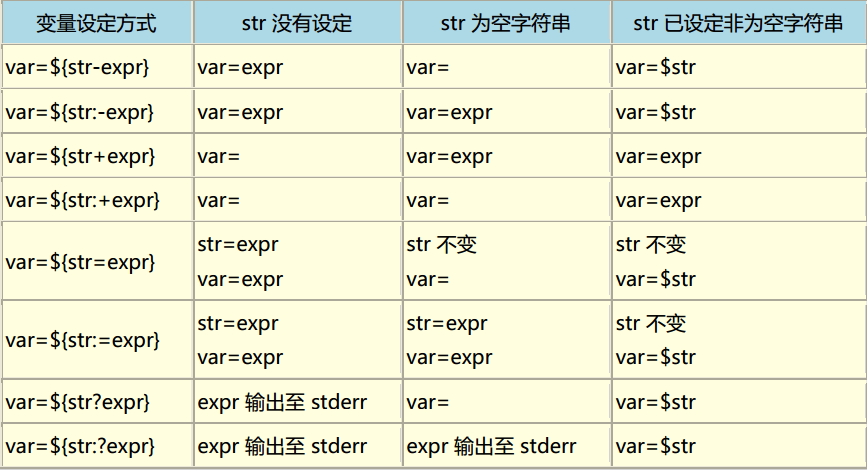

#### 特殊变量

* $0 当前脚本文件
* $n 传递给脚本或函数的参数,n 代表是一个数字,表示第几个参数.例如，第一个参数是$1，第二个参数是$2。
* $# 传递给脚本或函数的参数个数
* $@ 传递给脚本或函数的所有参数(分别表示)
* $* 传递给脚本或函数的所有参数(以一个整体)
* $$ 当前 shell 进程ID
* $? 上一个命令退出状态.或者函数的返回值
* $_ 上一个命令的路径 比如: git clone https://github.com/xxx/xx.git xx && cd $_

#### 变量替换

> https://www.cnblogs.com/gaochsh/p/6901809.html

* ${var} 变量本来的值
* ${var-DEFAULT}    如果变量没有声明,那么返回 DEFAULT ，但不改变 var 的值。
* ${var:-DEFAULT}	如果变量 var 为空或已被删除(unset)，那么返回 DEFAULT ，但不改变 var 的值。
* ${var=DEFAULT}    如果变量没有声明,那么返回 DEFAULT ，同时将 $var 赋值为 word 。
* ${var:=DEFAULT}	如果变量 var 为空或已被删除(unset)，那么返回 DEFAULT ，同时将 $var 赋值为 word 。
* ${var?ERR_MSG}    如果变量没有声明,那么返回 DEFAULT
* ${var:?ERR_MSG}	如果变量 var 为空或已被删除(unset)，那么将消息 ERR_MSG 送到标准错误输出，可以用来检测变量 var 是否可以被正常赋值。
若此替换出现在Shell脚本中，那么脚本将停止运行
* ${var+OTHER}	如果变量 OTHER 被定义，那么返回 OTHER ，否则返回空字符串,但不改变 var 的值。
* ${var:+OTHER}	如果变量 OTHER 被设置了，那么返回 OTHER ，否则返回空字符串,但不改变 var 的值。
* ${#value} 变量字符个数
* ${!varprefix*}	匹配之前所有以varprefix开头进行声明的变量
* ${!varprefix@}	匹配之前所有以varprefix开头进行声明的变量



#### Shell中的${}、##和%%使用范例

* ${file#pattern}
* ${file%pattern}

* ${file#*/}：删掉第一个 / 及其左边的字符串：dir1/dir2/dir3/my.file.txt
* ${file##*/}：删掉最后一个 /  及其左边的字符串：my.file.txt
* ${file#*.}：删掉第一个 .  及其左边的字符串：file.txt
* ${file##*.}：删掉最后一个 .  及其左边的字符串：txt

记忆方法

* # 是 去掉左边（键盘上#在 $ 的左边）
* %是去掉右边（键盘上% 在$ 的右边）
* 单一符号是最小匹配；两个符号是最大匹配
* ${file:0:5}：提取最左边的 5 个字节：/dir1
* ${file:5:5}：提取第 5 个字节右边的连续5个字节：/dir2

```
# 例子
str="abbc,def,ghi,abcjkl"
echo ${str#a*,}
# output: def,ghi,abcjkl
echo ${str##a*,}
# output: abcjkl
str="dir1/dir2/dir3/my.file.txt"
# output: dir1/dir2/dir3
echo ${str%/*}
# output: dir1
echo ${str%%/*}
```

###########
参考地址: [Bash Reference Manual](http://www.gnu.org/savannah-checkouts/gnu/bash/manual/bash.html#What-is-Bash_003f)

#### $() 与 ``

在 bash shell 中 $() 与`` 都是用来做命令替换用的

* ${} 用来做变量的替换 
* $(()) 可以做一些运算,抛弃 expr 等操作

#### (),(()),[],[[]],{},$(),$(()) 区别

**$()和 ` `**
> 命令替换

- $() 并不是所有shell都支持, `` 几乎都支持,但是容易看错

```
echo `uname -a`
echo $(uname -a)
```

**${ }**

- `${ }`用于变量替换。一般情况下，`$var` 与 `${var}` 并没有什么不一样，但是用 `${ }` 会比较精确的界定变量名称的范围。

```shell script
name=abc
echo "name: ${name}"
```

**$[] $(())**
> 主要数学运算
> If the value of the expression is non-zero, the return status is 0; otherwise the return status is 1

`$[]`和 `$(())` 是一样的，都是进行数学运算的。支持 `+ - * / %（“加、减、乘、除、取模”）`。但是注意，bash只能作整数运算，**对于浮点数是当作字符串处理的**。

```shell script
echo $[1*4]
echo $[1+4]
echo $[1-4]

echo $((1+2))
```
> let,expr 也支持数学运算

```shell script
let a=5+4
echo $a
```


**()**
> 主要处理数学,数组,子进程

- 命令组。括号中的命令将会新开一个子shell顺序执行，所以括号中的变量不能够被脚本余下的部分使用。括号中多个命令之间用分号隔开，最后一个命令可以没有分号，各命令和括号之间不必有空格。
- 命令替换。等同于`cmd`，shell扫描一遍命令行，发现了$(cmd)结构，便将$(cmd)中的cmd执行一次，得到其标准输出，再将此输出放到原来命令。有些shell不支持，如tcsh。
- 用于初始化数组。如：array=(a b c d)

```shell script
# 子进程内的变量,不能再外面使用
(name=1)
echo $name # 输出为空

# () 创建 subshell
for i in `seq 100`;do 
(
    curl -s http://ip.wlwz620.com -o /dev/null -w "http_code:%{http_code}:%{time_total}s\n";sleep 1; 
)
done
# 验证(pid 不断变化)
ps -ef | grep curl
```

**(())**
> 主要针对数学处理

* 数学运算: + - * / % (bash只能作整数运算，对于浮点数是当作字符串处理的)
* 逻辑运算: && ||
* 位移运算: <<,>>
* 异或运算: ~
* 位布尔: | & 
* 其他: var++(后增),var--(后减),++var(先增),--var(先减) , ! 逻辑求反,** 幂运算
* ==
```shell script
# 整数比较
if (( 1 == 2 )); then
  echo true
else
  echo false 
fi
# 字符串比较
if (( "hello" == "world" )); then
  echo true
else
  echo false 
fi
```


**[[]]**
> [] 的加强版

- bash把双中括号中的表达式看作一个单独的元素，并返回一个退出状态码。
- 数字比较: -eq, -ne, -gt, -ge, -lt, -le
- 字符串比较: =, != , -z 字符串, -n 字符串,>,<

使用`[[ ... ]]`条件判断结构，而不是`[ ... ]`，能够防止脚本中的许多逻辑错误。比如，`&&、||、<和>` 操作符能够正常存在于`[[ ]]`条件判断结构中，但是如果出现在`[ ]`结构中的话，会报错。
比如可以直接使用`if [[ $a != 1 && $a != 2 ]]`, 如果不使用双括号, 则为`if [ $a -ne 1] && [ $a != 2 ]`或者`if [ $a -ne 1 -a $a != 2 ]`。

````shell script
###  数字比较
if [[ 11 -gt 2 ]];then echo true;else echo false;fi
# output: true
# !!! 字符串 ascii 比较
if [[ 11 < 2 ]];then echo true;else echo false;fi
# output: true

### 字符串比较
if [[ '11' == 11 ]];then echo true;else echo false;fi
# output: true
if [[ '11' = 11 ]];then echo true;else echo false;fi 
# output: true
if [[ '11' != 11 ]];then echo true;else echo false;fi
# output: false

### && || 
if [[ 1 -gt 2 && 2 -gt 3  ]];then echo true;else echo false;fi
# output: false
if [[ 1 -lt 2 && 2 -gt 3  ]];then echo true;else echo false;fi
# output: false
if [[ 1 -lt 2 && 2 -lt 3  ]];then echo true;else echo false;fi
# output: true

# 前后有空格
if [[ 1!=2 && 1=2  ]];then echo 1; fi
1
# 正确
if [[ 1 != 2 && 1 = 1  ]];then echo 1; fi

# 逻辑真 (regex matching)  
if [[ "a.txt" =~ .*\.txt ]];then echo true; else echo false ; fi
# output:true
````
####  test 或者 []
> 只有两个结果: true,false(0,1)

* 数字测试: -eq, -ne, -gt, -ge, -lt, -le
* 字符串测试: =, != , -z 字符串, -n 字符串
* 文件测试: -e,-r,-w,-x,-s,-d,-f,-c,-b

```shell script
num1=100
num2=200
if test ${num1} -eq ${num2}
then
    echo '两个数相等！'
else
    echo '两个数不相等！'
fi


# [] 
# 等价于 test
# 算数运算
a=5
b=6
result=$[a + b] # 注意等号两边不能有空格 
# result=`expr $a + $b ` 等同于
echo "result 为： $result"

```

#### 算数运算符
```shell script
# if test
var1=1
var2=2
if test $var1 == 1 -a $var2 == 2; then
    echo "equal"
fi
# if []
if [ $var1 == 1 -a $var2 == 2 ]; then
    echo "equal"
fi
```
#### 字符串比较

* =      等于,如:if [ "$a" = "$b" ]
* ==     等于,如:if [ "$a" == "$b" ],与=等价
== 的功能在 [] 和 [[]] 的行为是不同的,例如: `[[ $a == z* ]]` 如果$a以"z"开头(模式匹配)那么将为true

* -z 字符串为 "",返回 true
* -n 字符串不为 "", -n 在 [] 结构内测试,必须用 `""` 将变量引起来.(习惯:使用`""`包裹变量)

#### 文件比较运算符

* -e filename 如果存在,则为真
* -d filename 如果为目录,则为真
* -f filename 如果为常规文件,则为真
* -L filename 如果为符号链接,则为真
* -r filename 如果可读则为真
* -w filename 如果可写则为真
* -x filename 如果可执行则为真
* filename1 -nt filename2 如果 filename1 比 filename2 新，则为真
* filename1 -ot filename2 如果 filename1 比 filename2 旧，则为真


**总结:**

算数运算:

* $[]
* $(())

逻辑运算:

* [[]]
* []

数组:

* ()

子命令:

* ()

执行命令:

* ``
* $()

#### RANDOM 生成随机数字

```shell script
# Well, seeing how this //is// BASH-hackers.org I kinda missed the bash way of doing the above ;-) 
# print a number between 0 and 500 :-)
printf $((  500 *  RANDOM  / 32767   ))

# Or print 30 random  numbers between 0 and 10 ;)
X=0; while (( X++ < 30 )); do echo $((  10 *  RANDOM  / 32767   )); done

####  -EOF 和<<EOF 区别?

cat <<EOF
    If you would like to use Docker as a non-root user
EOF
## EOF 前面有个制表符, -EOF 容错率更高
cat <<-EOF
    If you would like to use Docker as a non-root user
EOF
```

#### 数组

```shell script
array_name=(value0 value1 value2 value3)

# 循环 ${array_name[@]} or ${array_name[*]}
for i in ${array_name[@]}; do
    echo $i
done
# 长度
echo ${#array_name[@]}
```
#### 格式话输出


```shell script
printf "%d %s \n" 1 "abc"
# 9000 转换为 16进制(32位,不足的前面补0)
printf "%032x\n" 9000
```

#### for
```shell script
echo '-----1..100-----'
for loop in {1..100}; do
    echo $loop
done
echo '-----seq-----'
for loop in $(seq 1 100); do
    echo $loop
done
echo '-----for-----'
for ((i = 1; i <= 100; i++)); do
    echo $i
done
````

#### 文件解压

```shell script
# 解压文件去除第一层文件夹  (--strip-path 或者 --strip-components )
tar zxvf test.tar.gz --strip-components 1 -C web
````

#### 输入输出流

    #0:表示键盘输入(stdin)
    #1:表示标准输出(stdout),系统默认是1
    #2:表示错误输出(stderr)

    #command >/dev/null 2>&1 &  == command 1>/dev/null 2>&1 &

    #1)command:表示shell命令或者为一个可执行程序
    #2)>:表示重定向到哪里
    #3)/dev/null:表示linux的空设备文件
    #4)2:表示标准错误输出
    #5)&1:&表示等同于的意思,2>&1,表示2的输出重定向等于于1
    #6)&:表示后台执行,即这条指令执行在后台运行
    #
    #
    #
    #1>/dev/null:表示标准输出重定向到空设备文件,也就是不输出任何信息到终端,不显示任何信息。
    #2>&1:表示标准错误输出重定向等同于标准输出,因为之前标准输出已经重定向到了空设备文件,所以标准错误输出也重定向到空设备文件。

#### 其他

* shift 销毁一个参数，后面的参数前移


#### 相关命令

    tr 从标准输入设备读取数据，经过字符串转译后，将结果输出到标准输出设备(配合 sed 命令)


#### Bash 的错误处理

    # 写法一
    command xxx || { echo 'command failed'; exit 1;}
    # 写法二
    if ! command; then echo "command failed"; exit 1; fi
    # 写法三
    command
    if [ "$?" -ne 0 ]; then echo "command failed"; exit 1; fi

    # 如果两个命令有继承关系，只有第一个命令成功了，才能继续执行第二个命令，那么就要采用下面的写法。
    command1 && command2 

#### set 

* -a 标示已修改的变量，以供输出至环境变量。
* -x：执行指令后，会先显示该指令及所下的参数。
* +x: 关闭追踪
* -e 如果命令带非零值返回,立即退出(set -e有一个例外情况，就是不适用于管道命令。)
* -v：显示shell所读取的输入值。
* -u：当执行时使用到未定义过的变量，则显示错误信息。 
* -l：记录for循环的变量名称。
* -n 只读取指令，而不实际执行。
* -c "string" 从strings中读取命令
* -o 
    * set -o nounset  等价于 set -u
    * set -o xtrace  等价于 set -x
    * set -o errexit  等价于 set -e

    * set -o pipefail 可以结合 -e 使用 例如: set -eo pipfail

* set -- <params1> <params2> ...  参数1,2,相当于传递给 function 的变量,可以用 $# 获取个数


set命令的上面这四个参数，一般都放在一起使用。

```shell script
# 写法一
set -euxo pipefail

# 写法二
set -eux
set -o pipefail
```

这两种写法建议放在所有 Bash 脚本的头部。

另一种办法是在执行 Bash 脚本的时候，从命令行传入这些参数。
```
$ bash -euxo pipefail script.sh
```
#### eval

> $($n): eval  把$n 当作一个shell命令。
 
```shell script
$ set -- one two three  # 设置 $1 $2 $3
$ echo $1
one
$ n=1
$echo ${$n} ## 第一次尝试用大括号
bash: ${$n}: bad substitution
$ echo $($n) ## 第二次尝试用小括号
bash: 1: command not found

$ echo ${!n} ## 第三次尝试用!解析
one
$ eval echo \${$n}
one
```


##### 函数返回值

> 函数默认是将标准输出传递出来，不是返回值

* 函数return的值一般为 0(成功) 或者 1(失败),一般用在 if 语句判断是否执行成功,或者 $? 获取 return 值(必须为数字)执行状态码.
* 如果一定要返回其他类型的值可以采用👇的方式
    * 利用全局变量,在方法内部改变它
    * 利用输入输出流进行获取


1. function 返回状态码

```shell script
function get-num-nodes(){
    return 0
}
# get-num-nodes 失败时候输出 failed
if ! get-num-nodes ;then
    echo 'failed'
fi
```
2. 全局变量,获取返回值

```shell script
num=10
add(){
    ((num++))
}
add
echo $num
```
3. 标准输入输出获取返回值
```shell script
function get-num-nodes(){
    echo 'the function echo value' >&1
}
EXPECTED_NUM_NODES=$(get-num-nodes)
echo $EXPECTED_NUM_NODES
```
4. 通过 $? 获取返回值
```shell script
function get-num-nodes(){
    return 100
}

get-num-nodes
EXPECTED_NUM_NODES=$?
echo $EXPECTED_NUM_NODES
```

#### 背景颜色
```shell script
color_norm="\033[0m"
color_black="\033[30m"
color_red="\033[31m"
color_green="\033[32m"
color_yellow="\033[33m"
color_blue="\033[34m"
color_purple="\033[35m"
color_ksyblue="\033[36m"
color_white="\033[37m"

echo -e "${color_red} Failed to get nodes.${color_norm}"
```

#### declare

* -r 只读
    declare -r var1
* -i 整数声明
```shell script
declare -i number
number=3
echo "Number = $number"     # Number = 3
# 错误类型
number=three
echo "Number = $number"     # Number = 0
# 脚本尝试把字符串"three"作为整数来求值(译者注：当然会失败，所以出现值为0).

# 某些算术计算允许在被声明为整数的变量中完成，而不需要特别使用expr或let来完成。
n=6/3
echo "n = $n"       # n = 6/3
    
declare -i n
n=6/3
echo "n = $n"       # n = 2
        
* -a 数组声明
    
    declare -a indices
    indices=(a b c d)
    
* -f 列出函数
        decleare -f function_name
* -x 将声明一个变量作为脚本的环境变量而被导出
        declare -x var3=373
* -A 字典类型声明

```

```shell script
declare -A MasterDict
MasterDict=(['k8s-m1']=10.0.6.166 ['k8s-m2']=10.0.6.167 ['k8s-m3']=10.0.6.168)
for NODE in "${!MasterDict[@]}"; do
    echo "--- $NODE ${MasterDict[$NODE]} ---"
done
``` 
    
例子

```shell script
func1(){
    echo This is a function
}
decleae -f # 列出上面的函数
``` 
        

#### 压缩相关命令

* tar
    * 解包: tar zxvf xxx.tar
    * 打包: tar czvf filename.tar dirname
* gzip
    解压1：gunzip filename.gz
    解压2：gzip -d filename.gz
    压缩：gzip filename
    .tar.gz 和  .tgz
    压缩子文件: gzip -r dir
* zip
* z
    解压：uncompress filename.z
    压缩：compress filename
    .tar.z
* bz
    解压1：bzip2 -d filename.bz
    解压2：bunzip2 filename.bz
        .tar.bz

#### 信号 和 Traps

```shell script
# test trap command
trap "echo 'Sorry! I have trapped Ctrl-C';exit" SIGINT

echo This is a test script

count=1
while [ $count -le 10 ]
do
echo "Loop $count"
sleep 1
count=$[ $count + 1 ]
done

echo The end.
```
#### 数据类型判断

```shell script
## 类型判断
function check(){
    local a="$1"
    printf "%d" "$a" &>/dev/null && echo "integer" && return
    printf "%d" "$(echo $a|sed 's/^[+-]\?0\+//')" &>/dev/null && echo "integer" && return
    printf "%f" "$a" &>/dev/null && echo "number" && return
    [ ${#a} -eq 1 ] && echo "char" && return
    echo "string"
}

# usage
echo $(check 'name')
```
##### awk  结合 for 循环

```shell script
ips=$(cat ~/.ssh/config | grep 'HostName' | awk '{print $2}')
for i in `echo $ips`;do
        ssh-copy-id -i ~/.ssh/id_rsa.pub $i
done
```
##### Check for a Command in PATH
```shell script
# which,hash,command
# if which ls >/dev/null 2>&1; then
# if command -v ls >/dev/null 2>&1; then
if hash ls >/dev/null 2>&1; then
    echo "ls is available"
fi
```

调试
=====
> [参考](https://wiki.bash-hackers.org/scripting/debuggingtips)

- 调试信息可以使用 `logger` 写入到系统日志里面
- 注入调试代码
    
```shell script
echo "DEBUG: current i = $i " >&2
foo=$(< inputfile)
printf "DEBUG: foo is |%q|\n" "$foo" >&2
# exposes whitespace (such as CRs, see below) and non-printing characters

```

使用 shell 调试输出

> 使用`+`取消该选项

- `set -v` 在执行命令前,前打印该命令
- `set -x` 打印详细信息


调试脚本例子:

```shell script

debugme() {
    [[ $script_debug = 1 ]] && "$@" || :
    # be sure to append || : or || true here or use return 0, since the return code
    # of this function should always be 0 to not influence anything else with an unwanted
    # "false" return code (for example the script's exit code if this function is used
    # as the very last command in the script)
}
script_debug=1
# to turn it off, set script_debug=0

debugme logger "Sorting the database"
database_sort
debugme logger "Finished sorting the database, exit code $?"

```

当然，这可以用于在调试期间执行除echo之外的其他操作：

```shell script
debugme set -x
# ...一些代码......
debugme set + x
````

[比较完善的例子](../tools/debug.sh)


ftp 例子:

```shell script
if [[ $DRY_RUN = yes ]]; then
  sed 's/^/DRY_RUN FTP: /'
else
  ftp user@host
fi <<FTP
cd /data
get current.log
dele current.log
FTP
```
##### 正则表达式

> [参考: hell常用正则表达式](https://www.cnblogs.com/linuxws/p/6942574.html)
    
* ^ 行首
* $ 行尾
* . 除了换行符以外的任意单个字符
* *	前导字符的零个或多
* .*	所有字符
* []	字符组内的任一字符
* [^]	对字符组内的每个字符取反(不匹配字符组内的每个字符)
* ^[^]	非字符组内的字符开头的行
* [a-z] 小写字母
* [A-Z] 大写字母
* [a-Z] 小写和大写字母
* [0-9] 数字
* \<	单词头 单词一般以空格或特殊字符做分隔,连续的字符串被当做单词
* \>	单词尾
* /^$/ 表示空白行
    
使用正则的常用命令

- grep -E  或者 egrep
- awk 过滤
    
    - awk '/ro{1,3}/{print}' /etc/passwd

- sed 替换命令


##### shell 进行算数运算

- expr  只能整数
- $(()) 只能整数
- $[] 只能整数
- let 只能整数


* expr
  * echo `expr 100 + 10`
* $(())
  * echo $((100 + 10))
* $[]
  * echo $[10+1]
* let
  * let z=100+1


除数保留小数点

```shell script
# 由于 expr 不支持浮点除法,所以这里借助 bc 工具
echo "scale=2;10.1/2" | bc
# 或者借助 awk
awk 'BEGIN{printf "%.2f\n",10.1/2}'

```

##### expr
```shell script
expr --help
    match STRING REGEXP        same as STRING : REGEXP
    substr STRING POS LENGTH   substring of STRING, POS counted from 1
    index STRING CHARS         index in STRING where any CHARS is found, or 0
    length STRING              length of STRING
```

例子:

```shell script
### 字符串截取
str=abc1212abc 
echo ${str:0:4} 
# 或者
expr ${str:0:4} 
expr index "$str" "abc"
# output: 1
expr length "$str"   
# output: 10
expr substr $str 1 4 
# output: abc1
expr match $str '\([a-z]*\)'
# output: abc
```


##### 脚本专有变量

* BASH_SOURCE[0] 当前脚本文件
 
参考
====
- [wiki-hackers](https://wiki.bash-hackers.org/start)
- [awesome-shell](https://github.com/alebcay/awesome-shell/blob/master/README_ZH-CN.md)
- [Bash Reference Manual](http://www.gnu.org/savannah-checkouts/gnu/bash/manual/bash.html)
