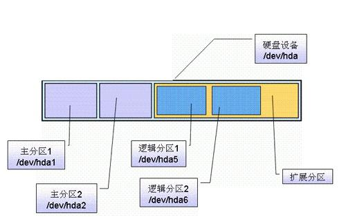

分区基础知识
====

主分区,也称为主磁盘分区,和扩展分区、逻辑分区一样,是一种分区类型。主分区中不能再划分其他类型的分区,因此每个主分区都相当于一个逻辑磁盘(在这一点上主分区和逻辑分区很相似,但主分区是直接在硬盘上划分的,逻辑分区则必须建立于扩展分区中)。

* 一个硬盘可以有1到3个主分区和1个扩展分区,也可以只有主分区而没有扩展分区,但主分区必须至少有1个,扩展分区则最多只有1个,且主分区+扩展分区总共不能超过4个。逻辑分区可以有若干个。  
* 分出主分区后,其余的部分可以分成扩展分区,一般是剩下的部分全部分成扩展分区,也可以不全分,剩下的部分就浪费了。
* 扩展分区不能直接使用,必须分成若干逻辑分区。所有的逻辑分区都是扩展分区的一部分。   硬盘的容量=主分区的容量+扩展分区的容量;   扩展分区的容量=各个逻辑分区的容量之和。




对于ide硬盘，驱动器标识符为“hdx”,其中“hd”表明分区所在设备的类型，这里是指ide硬盘了。**“x”为盘号（a为基本盘，b为基本从属盘，c为辅助主盘，d为辅助从属盘）**,“”代表分区，前四个分区用数字1到4表示，它们是主分区或扩展分区，**从5开始就是逻辑分区**。例，hda3表示为第一个ide硬盘上的第三个主分区或扩展分区,hdb2表示为第二个ide硬盘上的第二个主分区或扩展分区。对于scsi硬盘则标识为“sdx~”，scsi硬盘是用“sd”来表示分区所在设备的类型的，其余则和ide硬盘的表示方法一样，不在多说。

在 Linux 中规定，每一个硬盘设备最多能有 4个主分区（其中包含扩展分区）构成，任何一个扩展分区都要占用一个主分区号码，也就是在一个硬盘中，主分区和扩展分区一共最多是 4 个。

Linux 规定了主分区（或者扩展分区）占用 1 至 16 号码中的前 4 个号码。以第一个 IDE 硬盘为例说明，主分区（或者扩展分区）占用了 hda1、hda2、hda3、hda4，而逻辑分区占用了 hda5 到 hda16 等 12 个号码。
　　因此，Linux 下面每一个硬盘总共最多有 16 个分区。

查看系统分区详细信息
```
fdisk -l
或者
parted -l

Disk /dev/vda: 100 GiB, 107374182400 bytes, 209715200 sectors
Units: sectors of 1 * 512 = 512 bytes
Sector size (logical/physical): 512 bytes / 512 bytes
I/O size (minimum/optimal): 512 bytes / 512 bytes
Disklabel type: dos
Disk identifier: 0x77ba45a4

Device     Boot Start       End   Sectors  Size Id Type
/dev/vda1  *     2048 209715166 209713119  100G 83 Linux

```

id 和 Type 表示的是一个意思，id看起来不太直观，我们要在fdisk 一个分区时，通过指定id来确认分区类型；比如 7表示的就NTFS 分区；这个在fdisk 中要通过t功能来指定。83是linux。下面的部分会提到；

说明：硬盘分区的表示：在Linux 是通过hd*x 或 sd*x 表示的：

其中 * 表示的是a、b、c … …

另外 x 表示的数字 1、2、3 … …

hd大多是IDE硬盘；sd大多是SCSI或移动存储；引导（Boot）：表示引导分区，在上面的例子中sda1 是引导分区；

Start （开始）：表示的一个分区从 Xcylinder（磁柱）开始；

End （结束）：表示一个分区到 Ycylinder（磁柱）结束；