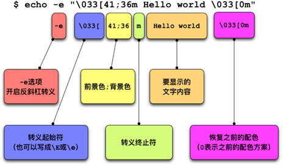

> echo: linux 输出命令

命令参数
---


案例
---
```bash
# 去除 \n
echo -n hello
# -e 开启转义
echo -e "abcdef\n"

# 显示转义字符
echo "\"It is a test\"" 
# or 
echo -e "\"It is a test\""

# 输出颜色
# 定义颜色变量, 还记得吧, \033、\e和\E是等价的
RED='\E[1;31m'       # 红
GREEN='\E[1;32m'    # 绿
YELOW='\E[1;33m'    # 黄
BLUE='\E[1;34m'     # 蓝
PINK='\E[1;35m'     # 粉红
RES='\E[0m'          # 清除颜色

# 真正使用时, 我们通过echo -e来调用
echo -e  "${RED}Red color${RES}"
echo -e  "${YELOW}Yelow color${RES}"
echo -e  "${BLUE}Blue color${RES}"
echo -e  "${GREEN}Green color${RES}"
echo -e  "${PINK}Pink color${RES}"

```

格式:

    echo -e "\033[颜色1;颜色2m 要展示的文字 \033[0m"    

格式详解:

- -e选项：表示允许反斜杠（对字符）转义。
- \033[颜色1；颜色2m：称为转义序列，它本身是一个整体，中间不要有空格。
- \033[：转义序列的开始。其中\033代表Esc符号，也可以使用\E或\e来代替。
- 颜色1和颜色2：表示字体的前景色或背景色，至于颜色1和颜色2哪一个表示前景色，哪一个表示背景色，由其设定的数值来决定，前景色和背景色的数值空间是不同的。
- m：转义序列的终止标志。
- \033[0m：表示将颜色恢复回原来的配色。



```
色彩	黑	红	绿	黄	蓝	洋红	青	白
前景色	30	31	32	33	34	35	36	37
背景色	40	41	42	43	44	45	46	47
```

拓展
---
> tput 命令会利用 terminfo 数据库中的信息，来控制和更改我们的终端，比如控制光标、更改文本属性、控制屏幕，以及为文本涂色

其中，为文本涂色的方法是：
 - tput setab：用于设置背景色；
 - tput setaf：用于设置前景色。


```bash
# 数值	 0	 1	 2	 3	 4	  5	    6	7
# 颜色	黑色	红色	绿色	黄色	蓝色	洋红色	黄色	白色

RED=$(tput setaf 1)
GREEN=$(tput setaf 2)
RESET=$(tput sgr0)
echo "${RED}red text ${GREEN}green text${RESET}"
```


参考
---


