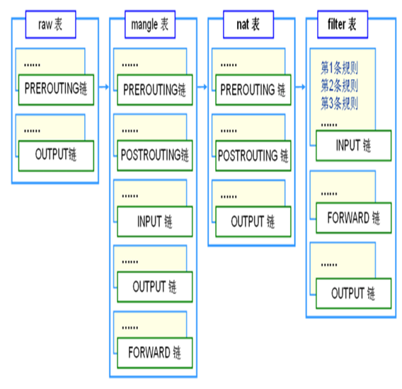
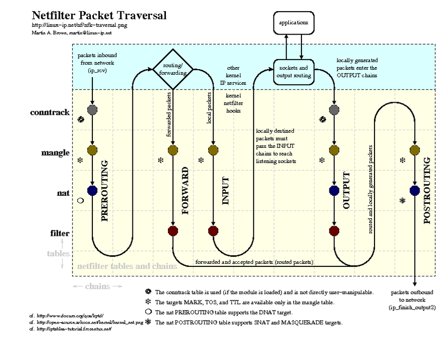
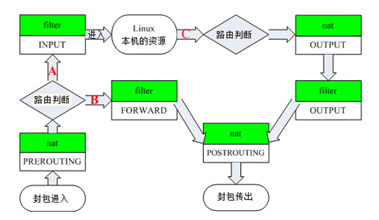
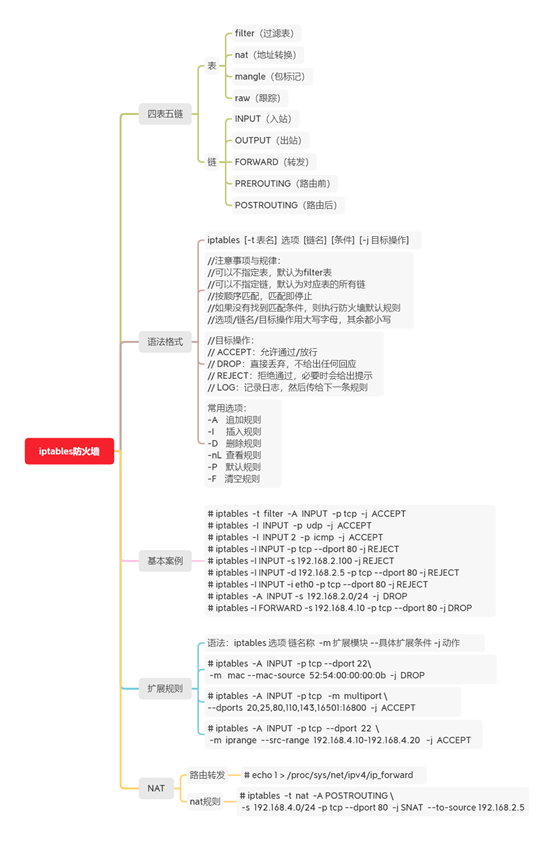

> iptables 防火墙
> iptables只是Linux防火墙的管理工具而已。真正实现防火墙功能的是 netfilter ，它是Linux内核中实现包过滤的内部结构。

> [参考](https://www.cnblogs.com/bethal/p/5806525.html)

四表五链概念:

- filter表——过滤数据包
- Nat表——用于网络地址转换（IP、端口）
- Mangle表——修改数据包的服务类型、TTL、并且可以配置路由实现QOS
- Raw表——决定数据包是否被状态跟踪机制处理

- INPUT链——进来的数据包应用此规则链中的策略
- OUTPUT链——外出的数据包应用此规则链中的策略
- FORWARD链——转发数据包时应用此规则链中的策略
- PREROUTING链——对数据包作路由选择前应用此链中的规则（所有的数据包进来的时侯都先由这个链处理）
- POSTROUTING链——对数据包作路由选择后应用此链中的规则（所有的数据包出来的时侯都先由这个链处理）

再来一张十分形象的netfilter图：

上图十分清晰的表明数据包的流向。由于四表中我们常用的就只有filter和nat，所以再来一张鸟哥版精简图：

参数
---

    -t 表名 (默认 filter)
    
    管理哦控制选项:

    -A 链名 (追加策略)
    -L 链路名 数字
    -I (insert)插入链，如果不加数字，默认是将写的策略添加到表中所有策略的前面
        例如: iptables -t filter -I INPUT 2 ...... 插入到第二个
    -D 删除指定链里的某条规则
    -R (replace)修改、替换指定链的某条规则，按序号或内容确定要替换的规则
    -F 清空指定链中的所有规则
    -N 新建一条用户自己定义的规则链
    -X（delete-chain）删除指定表中用户自己定义的规则链
    -n 使用数字形式（--number）显示输出结果，如显示主机的ip地址而不是主机名
    --line-number 查看规则列表时，同时显示规则在链中的顺序号
        注意: 添加规则有两个参数：-A和-I。其中-A是添加到规则的末尾；-I可以插入到指定位置，没有指定位置的话默认插入到规则的首部。

    匹配条件:
    -i  网卡    数据包进入的网卡
    -o  网卡   出去的
    -s  ip   源ip
    -d  ip    目的ip
    -p  协议
    --dport  端口号   目的端口号
    --sport   端口号   源端口号
    动作:
    ACCEPT：对满足策略的数据包允许通过
    DROP：丢弃数据包，且不返回任何信息
    REJECT：丢弃数据包，但是会返回拒绝的信息
    LOG：把通过的数据包写到日志中（相当于一个门卫对进去的人进行登记）

常用操作
---

    # 查看当前内存中iptables策略，默认是filter表  
    iptables -L  --line-numbers
    # 显示
    iptables -nvL --line-numbers
    -L 查看当前表的所有规则，默认查看的是filter表，如果要查看NAT表，可以加上-t NAT参数
    -n 不对ip地址进行反查，加上这个参数显示速度会快很多
    -v 输出详细信息，包含通过该规则的数据包数量，总字节数及相应的网络接口
    --line-numbers 显示规则的序列号，这个参数在删除或修改规则时会用到

    # 表的每条链后面都有一个默认动作，Chain INPUT (policy ACCEPT)
    # !!! 注意:以下命令将导致,您无法连接服务器
    # 修改 INPUT 不接受任何请求
    iptables -t filter -P INPUT DROP

    # 删除INPUT链的序号为1的策略  
    iptables -D INPUT 1  

    # 自定义链(Chain)
    iptables -N LOGGING #定义一个 LOGGING 链，相当于多了一扇门  
    iptables -t filter -A INPUT -j LOGGING  #把经过 INPUT 链的数据引入到 LOGGING 这个链上  
    iptables -A LOGGING -m limit --limit 2/min -j LOG --log-prefix "IPTables Packet Dropped: " --log-level 7 # 为这些包自定义个前缀，命名为"IPTables Packet Dropped"
    iptables -X LOGGING  # 删除 LOGGING 这条链  

    # 阻止经过 eht0 IP 地址为 "xx.xx.xx.xx" 的流量
    iptables -A INPUT -i eth0 -s "xx.xx.xx.xx" -j DROP

    # 允许所有来自外部的SSH连接请求，即只允许进入eth0接口，并且目标端口为22的数据包
    iptables -A INPUT -i eth0 -p tcp --dport 22 -m state --state NEW,ESTABLISHED -j ACCEPT
    iptables -A OUTPUT -o eth0 -p tcp --sport 22 -m state --state ESTABLISHED -j ACCEPT

    # 仅允许来自于 `192.168.100.0/24域` 的用户的ssh连接请求
    iptables -A INPUT -i eth0 -p tcp -s 192.168.100.0/24 --dport 22 -m state --state NEW,ESTABLISHED -j ACCEPT
    iptables -A OUTPUT -o eth0 -p tcp --sport 22 -m state --state ESTABLISHED -j ACCEPT

    # 允许出站的DNS连接
    iptables -A OUTPUT -p udp -o eth0 --dport 53 -j ACCEPT
    iptables -A INPUT -p udp -i eth0 --sport 53 -j ACCEPT

    # 端口转发 例：将来自422端口的流量全部转到22端口。
    # 这意味着我们既能通过422端口又能通过22端口进行ssh连接。启用DNAT转发。
    iptables -t nat -A PREROUTING -p tcp -d 192.168.102.37 --dport 422 -j DNAT --to 192.168.102.37:22
    除此之外，还需要允许连接到422端口的请求
    iptables -A INPUT -i eth0 -p tcp --dport 422 -m state --state NEW,ESTABLISHED -j ACCEPT
    iptables -A OUTPUT -o eth0 -p tcp --sport 422 -m state --state ESTABLISHED -j ACCEPT
实例
----

设置 iptables 开机自动加载

    iptables -A INPUT -p tcp -m state --state NEW -m tcp --dport 80 -j ACCEPT
    iptables -A INPUT -p tcp -m state --state NEW -m tcp --dport 443 -j ACCEPT
    iptables -A INPUT -s 106.14.205.100 -p tcp -j DROP
    
    # save
    iptables-save > /etc/iptables.rules
    
    # 开机自动启动
    cat > /etc/network/if-pre-up.d/up_iptables.sh <<EOF
    #!/bin/bash
    iptables-restore < /etc/iptables.rules
    EOF
    
    chmod a+x /etc/network/if-pre-up.d/up_iptables.sh
    

参考
----
- [iptables 四表五链](https://www.cnblogs.com/zhujingzhi/p/9706664.html)
- [iptables详解（8）：iptables扩展模块之state扩展](http://www.zsythink.net/archives/1597)
- [IBM:netfilter/iptables 简介](https://www.ibm.com/developerworks/cn/linux/network/s-netip/index.html)
- [linux系统中查看己设置iptables规则](https://blog.csdn.net/chengxuyuanyonghu/article/details/51897666)
- [[译] 深入理解 iptables 和 netfilter 架构](https://arthurchiao.github.io/blog/deep-dive-into-iptables-and-netfilter-arch-zh/)