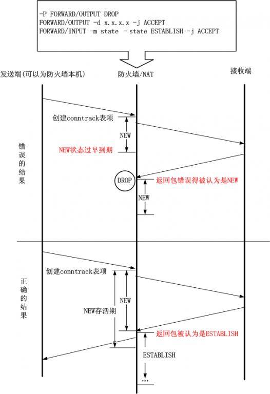

> nf_conntrack 模块 跟踪连接的状态

nf_conntrack 模块在 kernel 2.6.15（2006-01-03 发布） 被引入，支持 IPv4 和 IPv6，取代只支持 IPv4 的 ip_connktrack，用于跟踪连接的状态，供其他模块使用。

需要 NAT 的服务都会用到它，例如防火墙、Docker 等。以 iptables 的 nat 和 state 模块为例：

- nat：根据转发规则修改 IP 包的源/目标地址，靠 conntrack 记录才能让返回的包能路由到发请求的机器。
- state：直接用 conntrack 记录的连接状态（NEW/ESTABLISHED/RELATED/INVALID 等）来匹配防火墙过滤规则。

nf_conntrack 跟踪所有网络连接，记录存储在 1 个哈希表里。首先根据五元组算出哈希值，分配一个桶，如果有冲突就在链表上遍历，直到找到一个精确匹配的。如果没有匹配的则新建。

即使来自客户端的访问量不多，内部请求多的话照样会塞满哈希表，例如 ping 本机也会留下这么一条记录

    ipv4     2 icmp     1 29 src=127.0.0.1 dst=127.0.0.1 type=8 code=0 id=26067 src=127.0.0.1 dst=127.0.0.1 type=0 code=0 id=26067 mark=0 use=1

连接记录会在哈希表里保留一段时间，根据协议和状态有所不同，直到超时都没有收发包就会清除记录。如果服务器比较繁忙，新连接进来的速度远高于释放的速度，把哈希表塞满了，新连接的数据包就会被丢掉。此时 netfilter 变成了一个黑洞， 这发生在3层（网络层），应用程序毫无办法。

如果有人 DDoS 攻击的话情况更糟，无论是空连接攻击还是简单地用短连接发大量请求都能轻易塞满哈希表。或者更隐蔽点，研究了计算 conntrack hash 值的算法后，构造很多 hash 一致的不同五元组的数据包，让大量记录堆在同一个桶里，使得遍历超长的冲突链表的开销大得难以接受。在当前的内核 conntrack 模块实现中，这是无法避免的（除非关掉不用），因为所有鸡蛋都在一个篮子里面。

> dmesg 命令可以看到哈希表是否满

诊断
---
**netfilter 相关内核参数一览**

    sudo sysctl -a | grep conntrack
    # 如果找不到，恭喜，不用操心这问题了

查看超时相关参数

    sudo sysctl -a | grep conntrack | grep timeout

所谓超时是清除 conntrack 记录的秒数，从某个连接收到最后一个包后开始倒计时， 倒数到 0 就会清除记录，中间收到包会重置。

不同协议的不同状态有不同的超时时间。（注意记录里的状态只是个标识，跟连接本身的状态不一定是一一映射的关系，跟协议的标准或实现更是完全没有关系。）

***哈希表设置***
**查看哈希表大小（桶的数量）**
    sudo sysctl net.netfilter.nf_conntrack_buckets
    # 只读
**查看最大跟踪连接数**
进来的连接数超过这个值时，新连接的包会被丢弃。

    sudo sysctl net.netfilter.nf_conntrack_max
    # 默认 nf_conntrack_buckets * 4

    # max 是 bucket 的多少倍决定了每个桶里的链表有多长，因此默认链表长度为 4

比较现代的系统（Ubuntu 16+, CentOS 7+）里，64 位，8G 内存的机器，max 通常默认为 262144，bucket 为 65536。随着内存大小翻倍这 2 个值也翻倍。

**【注意】云服务厂商可能有不同的默认设置：**

- AWS 8G 以上这 2 个值似乎不再增加，64G 内存的机器和 8G 内存的机器一样。
- 阿里云目前（2018年）CentOS 7+ 的机器上似乎还在用 07 年 CentOS 5 时代的默认配置：max 为 65536，bucket 为 16384。因-此如果生产环境用阿里云服务器又没人了解这块的话，陷阱会来得特别早。

**查看 netfilter 模块加载时的默认值**

    sudo dmesg | grep conntrack
    # 找类似这样的记录：
    # nf_conntrack version 0.5.0 (65536 buckets, 262144 max)

**哈希表使用情况**

    sudo sysctl net.netfilter.nf_conntrack_count
    # 只读

    # 这个值跟 sudo conntrack -L 或 /proc/net/nf_conntrack （如果有这文件）里的条目数一致

这个值跟 `net.netfilter.nf_conntrack_buckets` 的值比较。

哈希表大部分桶不为空时（计算 得出约 69%，Python 的 dict 用 2/3，Java 的 HashMap 用 75%）哈希冲突的概率会增大，性能从 O(1) 退化为读链表的 O(n)，建议及时扩容。

网上有说法 `nf_conntrack_count` 的值持续超过 `nf_conntrack_max` 的 20% 就该考虑扩容”也是这原因。因为 bucket 的值默认是 max 的 25%，用了 max 的 20% 也就是 80% 的桶都有元素了（假设没冲突）。

跟踪连接记录

    # Ubuntu 通常没有 /proc/net/nf_conntrack 文件，用 conntrack 命令代替，输出一样
    sudo conntrack -L -o extended | tail -n 50
    # CentOS：
    sudo tail -n 50 /proc/net/nf_conntrack

    # 输出例：
    # ipv4     2 tcp      6 431999 ESTABLISHED src=10.0.13.67 dst=10.0.13.109 sport=63473 dport=22 src=10.0.13.109 dst=10.0.13.67 sport=22 dport=63473 [ASSURED] mark=0 secctx=system_u:object_r:unlabeled_t:s0 zone=0 use=2

    # 记录格式：
    # 网络层协议名、网络层协议编号、传输层协议名、传输层协议编号、记录失效前剩余秒数、连接状态（不是所有协议都有）
    # 之后都是 key=value 或 flag 格式，1 行里最多 2 个同名 key（如 src 和 dst），第 1 次出现的来自请求，第 2 次出现的来自响应

    # flag：
    # [ASSURED]  请求和响应都有流量
    # [UNREPLIED]  没收到响应，哈希表满的时候这些连接先扔掉

四层协议类型和连接数：

    sudo conntrack -L -o extended | awk '{sum[$3]++} END {for(i in sum) print i, sum[i]}'
    tcp 15759
    udp 46
    # 或：
    sudo cat /proc/net/nf_conntrack | awk '{sum[$3]++} END {for(i in sum) print i, sum[i]}'

TCP 连接各状态对应的条数：

    sudo conntrack -L -o extended | awk '/^.*tcp.*$/ {sum[$6]++} END {for(i in sum) print i, sum[i]}'
    SYN_RECV 9
    CLOSE_WAIT 26
    TIME_WAIT 13799
    ESTABLISHED 1567
    LAST_ACK 89
    CLOSE 244
    # 或：
    sudo cat /proc/net/nf_conntrack | awk '/^.*tcp.*$/ {sum[$6]++} END {for(i in sum) print i, sum[i]}'

三层协议类型和连接数：

    sudo conntrack -L -o extended | awk '{sum[$1]++} END {for(i in sum) print i, sum[i]}'
    ipv4 15798
    # 或：
    sudo cat /proc/net/nf_conntrack | awk '{sum[$1]++} END {for(i in sum) print i, sum[i]}'

连接数最多的 10 个 IP 地址：

    sudo conntrack -L -o extended | awk '{print $7}' | cut -d "=" -f 2 | sort | uniq -c | sort -nr | head -n 10
    # 或：
    sudo cat /proc/net/nf_conntrack | awk '{print $7}' | cut -d "=" -f 2 | sort | uniq -c | sort -nr | head -n 10

> stackoverflow - [details of /proc/net/ip_conntrack / nf_conntrack](http://stackoverflow.com/questions/16034698/details-of-proc-net-ip-conntrack-nf-conntrack)

实用案例

    # 查看监听当中的连接
    # netstat 查看(可以在docker 内部查看,比如 lb 内部,但是在宿主机上面无法查看 docker 容器的)
    netstat -ntu | grep ESTABLISHED |  awk '{print $5}' | cut -d: -f1 | sort | uniq -c | sort -n
    # 可以在宿主机上面查看
    conntrack -L -o extended | grep ESTABLISHED  | awk '{print $7}' | cut -d "=" -f 2 | sort | uniq -c | sort -nr | head -n 10

**配置**

**A. 关闭使用 NAT 的程序**

最常见的是防火墙，目前第 2 常见的可能是 docker。依赖 netfilter 模块的服务关掉之后，通常 `sudo sysctl -a | grep conntrack` 就找不到相关的参数了。

对不直接暴露在公网，也不使用 NAT 转发的服务器来说，关闭 Linux 防火墙是最简单的办法，还避免了防火墙/netfilter 成为网络瓶颈。使用公有云的话可以用厂商提供的安全服务，通常是独立于你租的云服务器的，不消耗资源，比自己用系统防火墙设一大堆规则好得多。

**Ubuntu 防火墙**

    sudo ufw disable

**firewalld**
CentOS 7.x 默认安装。

    sudo systemctl stop firewalld
    sudo systemctl disable firewalld

**iptables**
CentOS 6.x 默认安装。

    # 使用 SystemV init 管理的旧系统：
    sudo service iptables stop
    sudo chkconfig --del iptables
    # 网上有些老文章说关了 iptables 之后，用 "iptables -L -n" 等命令查看防火墙规则也会导致 nf_conntrack 重新加载，实测并不会

    # 使用 systemd 管理的新系统：
    sudo systemctl stop iptables
    sudo systemctl disable iptables

**dockerd**

系统是最小安装的话应该不会自带。如果发现系统里有 docker 的网卡在，又确定没有地方用到 docker 的话就关掉：

    sudo systemctl stop docker
    sudo systemctl disable docker

如果 conntrack 相关参数还没消失，看看模块是不是还在：

    lsmod | egrep "Module|ip_table|iptable|ip6|ipt|nat|conntrack"

    # 有可能会匹配到不相关的，最好对照一下这里
    find /lib/modules/$(uname -r) -type f -name '*.ko*' | grep netfilter

    # 查看模块详细信息
    modinfo <module>
禁用模块：

    sudo modprobe [-f] -r <module> [<module2> ...]
    # 或：
    sudo rmmod [-f] <module>

    # 未使用（Used by 栏为 0）的模块才能禁用。
    # 如果 Used by 不为 0，先禁用后面列出的模块。

    # 如果后面没模块名，就是被进程使用。
    # 没有简单的方法能查到调用这些模块的都是什么进程，基本靠猜。

    # 查看启动信息，看有没有有用的线索（多半没有）
    dmesg | egrep "ip_table|netfilter|conn"

**B. 调整内核参数**

如果调用 netfilter 的进程不能关，或查不出什么进程在用，就要靠调整参数来尽量推迟出问题的时间。

主要设置项：

- 哈希表扩容（nf_conntrack_buckets、nf_conntrack_max）
- 让里面的元素尽快释放（超时相关参数）
`nf_conntrack_buckets` 和 `nf_conntrack_max` 的默认值怎么来的
根据这篇 08 年的 [wiki](https://wiki.khnet.info/index.php/Conntrack_tuning) `，nf_conntrack_max` 的默认值算法为：

    CONNTRACK_MAX = RAMSIZE (in bytes) / 16384 / (ARCH / 32) 

- 其中 ARCH 为 CPU 架构，值为 32 或 64。
- 即：32 位系统使用内存的 1/16384，64 位系统再减半。
- 对于 64 位 8G 内存的机器：(8 * 1024^3) / 16384 / (64 / 32) = 262144

`nf_conntrack_buckets` 默认值算法为：

    HASHSIZE = CONNTRACK_MAX / 4
    # 比较早的版本是除以 8
    # 这里的 4 或 8 就是每个桶里的链表最大长度

对于 64 位 8G 内存的机器：262144 / 4 = 65536

**给哈希表扩容的影响**

主要是内存使用增加。32 位系统还要关心内核态的地址空间够不够。

netfilter 的哈希表存储在内核态的内存空间，这部分内存不能 swap，操作系统为了兼容 32 位，默认值往往比较保守。

- 32 位系统的虚拟地址空间最多 4G，其中内核态最多 1G，通常能用的只有前 896M。
给 netfilter 分配太多地址空间可能会导致其他内核进程不够分配。1 条跟踪记录 300 字节左右，因此当年 nf_conntrack_max 默认 65535 条，占 20多MB。
- 64 位系统的虚拟地址空间有 256TB，内核态能用一半，只需要关心物理内存的使用情况。
计算内存使用的公式还是来自上面的 wiki：

    size_of_mem_used_by_conntrack (in bytes) = CONNTRACK_MAX * sizeof(struct ip_conntrack) + HASHSIZE * sizeof(struct list_head)

- sizeof(struct ip_conntrack) 在不同架构、内核版本、编译选项下不一样。这里按 352 字节算。
老文章说模块启动时会在 syslog 里打印这个值，但现在没有。
- sizeof(struct list_head) = 2 * size_of_a_pointer（32 位系统的指针大小是 4 字节，64 位是 8 字节）
- 64 位系统，8G 内存的机器，按默认 CONNTRACK_MAX 为 262144，HASHSIZE 为 65536 时：262144 * 352 + 65536 * 8 = 92798976（88.5 MB）
- 
互联网公司的服务器通常内存没那么紧张，可以放开点：

- CONNTRACK_MAX 为 1048576，HASHSIZE 为 262144 ：1048576 * 352 + 262144 * 8 = 371195904（354 MB）
等业务发展到 nf_conntrack_count 经常保持在 18万（bucket 的 2/3）以上时再考虑翻倍。

（测试方法：压测工具不用 keep-alive 发请求，调大 `nf_conntrack_tcp_timeout_time_wait` ，单机跑一段时间就能填满哈希表。观察响应时间的变化和服务器内存的使用情况。）

    # -k 表示使用 keep-alive
    ab -c1000 -n 100000 -k  -r -s 2 http://127.0.0.1:8080/

**调整哪些超时时间**

如果你的程序需要读取 conntrack 记录，或者服务器设了复杂的 iptables 规则（同样需要读取 conntrack 记录），超时时间的设置需要非常谨慎：

如果 conntrack 记录对你不重要，用之前的命令查一下哪种协议哪种状态的连接最多，尝试把对应的超时参数调小。占比很少或根本用不到的可以不管。

例如 Nginx 服务器上可能会看到 90% 以上的记录都是 TIME_WAIT 状态（Nginx 连后端服务默认用短连接）。

对于通外网的服务器，考虑调整以下参数，减少 DDoS 的危害：

- net.netfilter.nf_conntrack_tcp_timeout_established：默认 432000 （5天）
  - 这个值对应的场景是 “双方建立了连接后一直不发包，直到 5 天后才发” ……
  - 但默认 keep-alive 超时时间只有 2 小时 11 分（net.ipv4.tcp_keepalive_time + net.ipv4.tcp_keepalive_intvl * net.ipv4.tcp_keepalive_probes），由于超时关 socket 不发包，conntrack 无法根据包头的标识知道状态的变化，记录会一直处于 ESTABLISHED 状态，直到 5 天后倒计时结束才删掉。
  - 空连接攻击的最佳目标。攻击者把 IP 包头的源地址改成随机 IP，握完手就关 socket，用一台机发请求就能把你的哈希表填满。

- net.netfilter.nf_conntrack_tcp_timeout_syn_recv：默认 60
  - 类似，故意不发握手的 ACK 即可。但这个超时时间没那么夸张，系统也有 syn cookie 机制来缓解 syn flood 攻击。
  

其他值得注意的参数：

- net.netfilter.nf_conntrack_tcp_timeout_syn_sent：默认 120
    - 你的程序的 connect timeout 有这么长吗？
- net.netfilter.nf_conntrack_tcp_timeout_fin_wait：默认 120
  - net.ipv4.tcp_fin_timeout 默认 60 秒，通常还会参考 BSD 和 macOS 设成更小的值。这里往往也没必要这么大。
- net.netfilter.nf_conntrack_icmp_timeout：默认 30
- 哪里的 ping 会等 30 秒才超时？
  
这几个倒是比较合理，小于等于可能遇到的极端情况，但如果不想半关闭的连接的记录继续占着宝贵的哈希表，提早清了似乎也没什么问题：

- net.netfilter.nf_conntrack_tcp_timeout_time_wait：默认 120
  - Linux 里的 MSL 写死 60 秒（而不是 TCP 标准里拍脑袋的 120 秒），TIME_WAIT 要等 2MSL，这里 120 算是个合理的值。
  - 但现在默认有 PAWS（`net.ipv4.tcp_timestamps`），不会出现标准制定时担心的迷途报文回来碰巧污染了序列号相同的新连接的数据的情况， 互联网公司基本都开 `net.ipv4.tcp_tw_reuse`，既然半连接都不留这么久，记录似乎也不需要留这么久。

- net.netfilter.nf_conntrack_tcp_timeout_close_wait：默认 60
  - CLOSE_WAIT 状态是让被动关闭方把该传的数据传完。如果程序写得不好，这里抛了未捕捉的异常，也许就走不到发 FIN 那步了，一直停在这里。
- net.netfilter.nf_conntrack_tcp_timeout_last_ack：默认 30
  - 被动关闭方发 FIN 后如果一直收不到对面的 ACK 或 RST，会不断重发，直到超时才 CLOSE。`net.ipv4.tcp_retries2` 的默认值是 15，最多要等 924.6 秒……不过一般都会调小这个值。

内核参数优化
----

linux TIME_WAIT 相关参数: [参考:tcp_tw_reuse、tcp_tw_recycle 使用场景及注意事项](https://www.cnblogs.com/lulu/p/4149312.html)

    net.ipv4.tcp_tw_reuse = 0    表示开启重用。允许将 TIME-WAIT sockets重新用于新的TCP连接，默认为0，表示关闭
    net.ipv4.tcp_tw_recycle = 0  表示开启TCP连接中 TIME-WAIT sockets 的快速回收，默认为0，表示关闭
    net.ipv4.tcp_fin_timeout = 60  表示如果套接字由本端要求关闭，这个参数决定了它保持在 FIN-WAIT-2 状态的时间

对于服务端: 
- net.ipv4.tcp_tw_reuse 启用 TIME-WAIT 状态sockets的快速回收，这个选项不推荐启用。在 NAT(Network Address Translation)网络下，会导致大量的TCP连接建立错误。
- net.ipv4.tcp_tw_reuse 从协议设计上来看，对于 TIME-WAIT 状态的sockets重用到新的 TCP 连接上来说，是安全的。（用于客户端时的配置）

**TL;DR**

除了有关联的参数，尽量一次只改一处，记录下默认值和上次改的值，效果不明显或更差就还原。修改完要多观察一段时间，确保不会影响业务。

`net.netfilter.nf_conntrack_buckets` 参数是只读的，不能直接改，需要修改模块的设置：

    # 改为 262144
    echo 262144 | sudo tee /sys/module/nf_conntrack/parameters/hashsize

    # 再查看，此时 bucket 已经变成刚才设置的值
    sudo sysctl net.netfilter.nf_conntrack_buckets

`net.netfilter.nf_conntrack_max` 参考默认值，设为桶的 4 倍：

    sudo sysctl net.netfilter.nf_conntrack_max=1048576
    # 改完可以看到 net.netfilter.nf_conntrack_max 和 net.nf_conntrack_max 都变了

超时的值要根据业务和网络环境设置，这里只是举例，*不要照抄（参考了 这个做路由器的公司的设置*）：

    sudo sysctl net.netfilter.nf_conntrack_icmp_timeout=10

    sudo sysctl net.netfilter.nf_conntrack_tcp_timeout_syn_recv=5
    sudo sysctl net.netfilter.nf_conntrack_tcp_timeout_syn_sent=5

    sudo sysctl net.netfilter.nf_conntrack_tcp_timeout_established=600

    sudo sysctl net.netfilter.nf_conntrack_tcp_timeout_fin_wait=10
    sudo sysctl net.netfilter.nf_conntrack_tcp_timeout_time_wait=10

    sudo sysctl net.netfilter.nf_conntrack_tcp_timeout_close_wait=10
    sudo sysctl net.netfilter.nf_conntrack_tcp_timeout_last_ack=10

用 `sysctl [-w]` 或 `echo xxx > /pro/sys/net/netfilter/XXX` 做的修改在重启后会失效。如果测试过没问题，在` /etc/sysctl.d/` 下新建配置文件，这里以 `90-conntrack.conf `为例（CentOS 6 等旧系统编辑 /etc/sysctl.conf），系统启动时会加载里面的设置：

    # 格式：<参数>=<值>，等号两边可以空格，支持 # 注释
    net.netfilter.nf_conntrack_max=1048576

    net.netfilter.nf_conntrack_icmp_timeout=10
    net.netfilter.nf_conntrack_tcp_timeout_syn_recv=5
    net.netfilter.nf_conntrack_tcp_timeout_syn_sent=5
    net.netfilter.nf_conntrack_tcp_timeout_established=600
    net.netfilter.nf_conntrack_tcp_timeout_fin_wait=10
    net.netfilter.nf_conntrack_tcp_timeout_time_wait=10
    net.netfilter.nf_conntrack_tcp_timeout_close_wait=10
    net.netfilter.nf_conntrack_tcp_timeout_last_ack=10

如果修改了配置文件，要马上应用配置文件里的设置：

    sudo sysctl -p /etc/sysctl.d/90-conntrack.conf
    # 不传文件路径默认加载 /etc/sysctl.conf

**C. 设置不跟踪连接的规则**

对需要防火墙的机器，可以设置 NOTRACK 规则，减少要跟踪的连接数。

（注意：以下未经仔细测试，当时我们生产环境选择直接关防火墙。）

以 iptables 为例，查看所有规则：

    sudo iptables-save

这个必须插在第1条，凡是不跟踪的肯定是你想放行的：

    sudo iptables -I INPUT 1 -m state --state UNTRACKED -j ACCEPT
    # 设置成不跟踪的连接无法拿到状态，包含状态（-m state --state）的规则统统失效。
    # iptables 处理规则的顺序是从上到下，如果这条加的位置不对，可能导致请求无法通过防火墙。

不跟踪本地连接：

    sudo iptables -t raw -A PREROUTING -i lo -j NOTRACK
    sudo iptables -t raw -A OUTPUT -o lo -j NOTRACK

    # 假如 Nginx 和应用部署在同一台机子上，增加这规则的收益极为明显。
    # Nginx 连各种 upstream 使得连接数起码翻了倍，不跟踪本地连接一下干掉一大半。

- -t raw 会加载 iptable_raw 模块（kernel 2.6+ 都有）
- raw 表基本就干一件事，通过 -j NOTRACK 给不需要被连接跟踪的包打标记（UNTRACKED 状态），告诉 nf_conntrack 不要跟踪连接
- raw 的优先级大于 filter，mangle，nat，包含 PREROUTING（针对进入本机的包） 和 OUTPUT（针对从本机出去的包） 链
不跟踪某些端口的连接：

    sudo iptables -t raw -A PREROUTING -p tcp -m multiport --dports 80,443 -j NOTRACK
    sudo iptables -t raw -A OUTPUT -p tcp -m multiport --sports 80,443 -j NOTRACK
    
配完防火墙规则记得留意后台服务还能不能连得上、响应时间有没有异常、某些 TCP 状态有没有异常增加……

确定没问题就保存规则（否则重启服务后失效）：

    # CentOS 6 等使用 SystemV init 的旧系统：

    sudo service iptables save
    # 其实就是把 iptables-save 的内容存到 /etc/sysconfig/iptables
比较新的发行版参考以下：（未验证过）

再次深入到ip_conntrack的 conntrack full 问题(相关笔记)
---
不要过度减小 NEW 以及 TCP 的 establish的 CT 状态的timeout的原因

UDP:

ip_conntrack_udp_timeout 配置过于短暂造成的那问题: 客户端只放行状态为 establish的入流量,但是 NEW状态的 conntrack 过早释放,这将不会有 establish 状态流量了,对于 UDP 而言,由于它是不确认无连接允许丢包的，因此影响还不是很大

TCP:

如果你连接一个很远的且网络状况很恶劣的TCP服务器，然后你把 `ip_conntrack_tcp_timeout_synsent` 设置很小，这样就几乎完不成三次握手了，更进一步，如果你把 `ip_conntrack_tcp_timeout_established` 设置过小，那么一旦三次握手建立连接之后，客户端和服务器之间很久不发包，当 establish 状态到期后，conntrack被释放，此时服务器端主动发来一个包，该包的 conntrack 状态会是什么呢？因此**给予tcp的establish状态5天的时间，是可以理解的**。需要注意的是，对于tcp而言，**由于无法简单的控制服务器发送 syn-ack 的延时，因此需要在 establish 状态而不是new状态做文章了**(实际上，ip_conntrack的establish状态映射成了tcp的多个状态，包括`syn-ack，ack，established`)，试试看，效果和udp的一样。

conntrack full 解决思路:

并不是conntrack容量太小或者表项保留时间过长引发的full。现实中的万事万物都不是无限的，对于计算机资源而言，更应该节约使用，不能让无关人士浪费这种资源，另外既然内核默认了一个表项的存活时间，那肯定是经过测试的经验值，自有它的道理。因此本质问题在于很多不需要conntrack的包也被conntrack了，这样就会挤掉很多真正需要conntrack的流量。

那么都是哪些流量需要conntrack呢？常用的就两个，一个是任何使用ctstate或者state这些match的iptables规则，另外一个就是所有的iptables的nat表中的规则，如果我们事先知道哪些流量需要使用iptables的[ct]state来控制，并且也知道哪些流量需要做NAT，那么余下的流量就都是和conntrack无关的流量了，可以不被ip_conntrack来跟踪。

幸运的是，Linux的 Netfilter 在 PREROUTING 以及 OUTPUT 这两个HOOK 的 conntrack 之前安插了一个优先级更高的table，那就是 raw ，通过它就可以分离出不需要被 conntrack 的流量。如果你确定只有某个网卡进来的流量才需要做 NAT ，那么就执行下面的规则：

    iptables -t raw -A PREROUTING ! –I <网卡> -j NOTRACK
    iptables –t raw –A OUTPUT –j NOTRACK

同时采取三种方式比较有效：
- 增大conntrack_max
- 减少状态保存时间
- 分离无关流量。
  
然而除了第三种方式，其余两种方式在操作时必须给自己十足的理由那么做才行，对于 1，比必须明白内核内存被占有的方式(需要计算内存大小)，对于2，则是前面这部分关于 tcp,udp 的 timeout 问题。

    iptables -A FORWARD -m state --state UNTRACKED -j ACCEPT

参考
--
- [原文地址](https://testerhome.com/topics/15824)
- [再次深入到ip_conntrack的conntrack full问题](https://blog.csdn.net/dog250/article/details/7262619)
