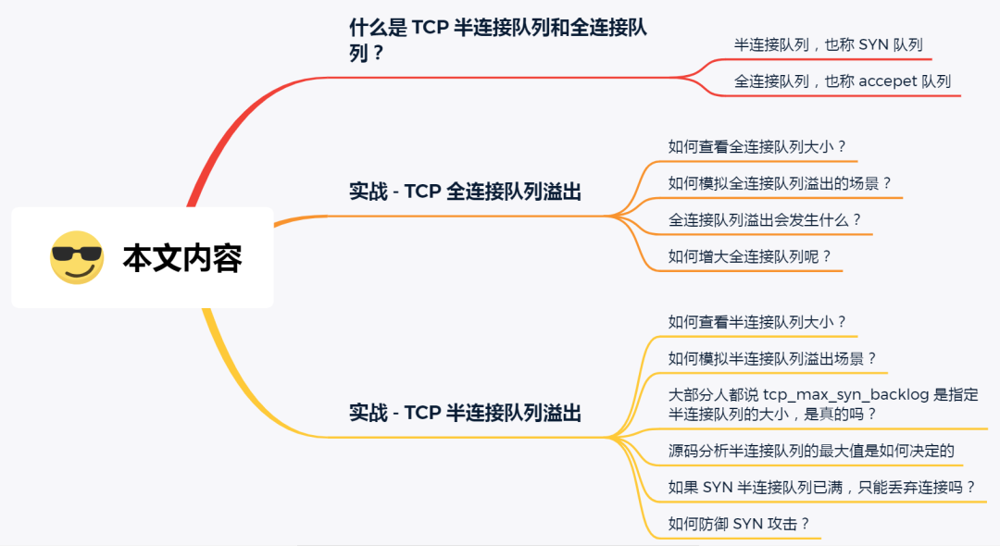
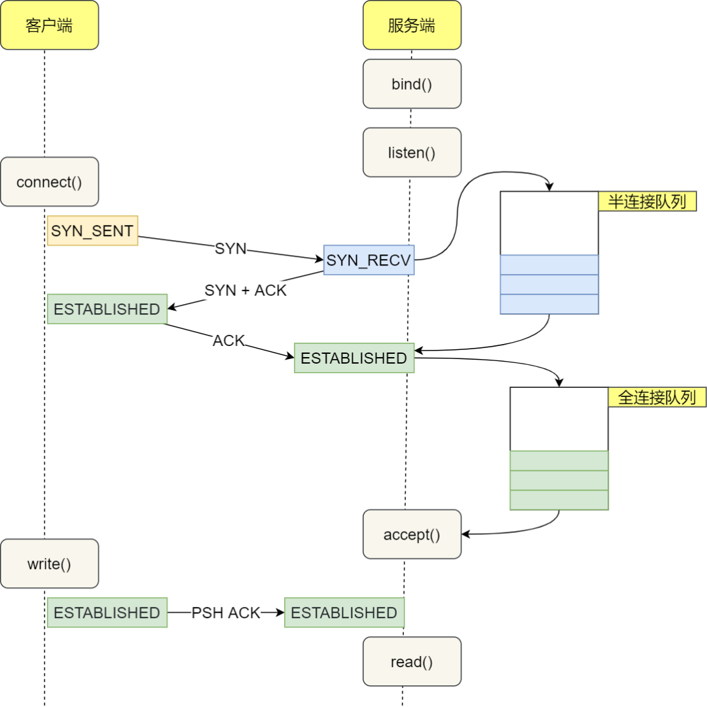

## # 关于TCP连接的TIME-WAIT状态，它是为何而生，存在的意义是什么？


当TCP连接关闭之前，首先发起关闭的一方会进入TIME-WAIT状态，另一方可以快速回收连接。

可以用 `ss -tan`来查看TCP 连接的当前状态

    ss -tan
    State      Recv-Q Send-Q                   Local Address:Port                                  Peer Address:Port         
    LISTEN     0      128                                  *:22                                               *:* 
    LISTEN     0      1                            127.0.0.1:32000                                            *:*    

一台机器最多能创建多少个 TCP 连接？
=====

本地端口范围

````bash
cat /proc/sys/net/ipv4/ip_local_port_range
32768	60999
````
如何修改

````
vim /etc/sysctl.conf
# 增加(限制端口只能使用10个啦)
net.ipv4.ip_local_port_range = 60000 60009
# 生效
sysctl -p /etc/sysctl.conf
````
建立一个 TCP 连接，需要将通信两端的套接字（socket）进行绑定，如下：

> 源 IP 地址：源端口号 <---->  目标 IP 地址：目标端口号

只要这套绑定关系构成的四元组不重复即可，刚刚端口号不够用了，是因为我一直对同一个目标IP和端口建立连接。所以说最多只能创建 65535 个TCP连接是多么荒唐。

***文件描述符***

系统级：当前系统可打开的最大数量，通过 `cat /proc/sys/fs/file-max` 查看

用户级：指定用户可打开的最大数量，通过 `cat /etc/security/limits.conf` 查看

进程级：单个进程可打开的最大数量，通过 `cat /proc/sys/fs/nr_open` 查看


***总结***

影响因素:

- 进程\线程数 ulimit -n
- 文件描述符 fs.file-max
- 内存
- CPU
- 临时端口号 ip_local_port_range


TCP 半连接队列和全连接队列满了会发生什么？又该如何应对？
=====

前言
====
网上许多博客针对增大 TCP 半连接队列和全连接队列的方式如下：
- 增大 TCP 半连接队列方式是增大 tcp_max_syn_backlog；
- 增大 TCP 全连接队列方式是增大 listen() 函数中的 backlog；

这里先跟大家说下，上面的方式都是不准确的。

本文的提纲:



正文
===

**什么是 TCP 半连接队列和全连接队列？**

在 TCP 三次握手的时候，Linux 内核会维护两个队列，分别是：

- 半连接队列，也称 SYN 队列；

- 全连接队列，也称 accepet 队列；

服务端收到客户端发起的 SYN 请求后，**内核会把该连接存储到半连接队列**，并向客户端响应 SYN+ACK，接着客户端会返回 ACK，服务端收到第三次握手的 ACK 后，**内核会把连接从半连接队列移除，然后创建新的完全的连接，并将其添加到 accept 队列，等待进程调用 accept 函数时把连接取出来**。



不管是半连接队列还是全连接队列，都有最大长度限制，超过限制时，内核会直接丢弃，或返回 RST 包。

实战 – TCP 全连接队列溢出
===
> 如何知道应用程序的 TCP 全连接队列大小？

在服务端可以使用 ss 命令，来查看 TCP 全连接队列的情况：

但需要注意的是 ss 命令获取的 **Recv-Q/Send-Q** 在「LISTEN 状态」和「非 LISTEN 状态」

在「LISTEN 状态」时，Recv-Q/Send-Q 表示的含义如下：

````
# -l 显示正在监听 (listening) 的 socket
# -n 不解析服务名称
# -t 只显示 tcp socket

State      Recv-Q Send-Q     Local Address:Port   Peer Address:Port
LISTEN     0      32768      :::5921                :::*
LISTEN     0      32768      :::5921                :::*               
LISTEN     0      128        :::8080                :::* 
LISTEN     0      10          *:3000                *:*
````

- Recv-Q：当前全连接队列的大小，也就是当前已完成三次握手并等待服务端 accept() 的 TCP 连接个数；
- Send-Q：当前全连接最大队列长度，上面的输出结果说明监听 8088 端口的 TCP 服务进程，最大全连接长度为 128；

在「非 LISTEN 状态」时，Recv-Q/Send-Q 表示的含义如下：

````
# -n 不解析服务名称
# -t 只显示 tcp socket
$ ss -nt
State      Recv-Q Send-Q     
ESTAB      0      40        127.0.0.1:46400              127.0.0.1:3000               
ESTAB      0      40        127.0.0.1:52026              127.0.0.1:3000 
````

- Recv-Q：已收到但未被应用进程读取的字节数；
- Send-Q：已发送但未收到确认的字节数；


> 如何模拟 TCP 全连接队列溢出的场景？

````
# 客户端对服务端进行压测
# -t 2 表示 6个 线程
# -c 5000 表示 5000 个连接
# -d 60s 表示持续压测 60s
wrk -t 2 -c 5000 -d 60s http://127.0.0.1:3000
Running 1m test @ http://127.0.0.1:3000
  2 threads and 5000 connections

````

在服务端可以使用 ss 命令，来查看当前 TCP 全连接队列的情况：

````
# 服务端查看 TCP 全连接队列的情况
$ ss -lnt | grep 3000
State      Recv-Q Send-Q 
LISTEN     7      10           *:3000                     *:* 
$ ss -lnt | grep 3000
State      Recv-Q Send-Q 
LISTEN     11     10           *:3000                     *:*      
````

其间共执行了两次 ss 命令，从上面的输出结果，可以发现当前 TCP 全连接队列上升到了 129 大小，超过了最大 TCP 全连接队列。

当超过了 TCP 最大全连接队列，服务端则会丢掉后续进来的 TCP 连接，丢掉的 TCP 连接的个数会被统计起来，我们可以使用 **netstat -s** 命令来查看：

````
# 查看 TCP 全连接队列溢出情况
$ date; netstat -s | grep overflowed
Sun Jun 28 10:43:39 CST 2020
    142383 times the listen queue of a socket overflowed

$ date; netstat -s | grep overflowed
Sun Jun 28 10:43:52 CST 2020
    164550 times the listen queue of a socket overflowed

````

上面看到的 142383 times ，表示全连接队列溢出的次数，注意这个是累计值。可以隔几秒钟执行下，如果这个数字一直在增加的话肯定全连接队列偶尔满了。

从上面的模拟结果，可以得知，**当服务端并发处理大量请求时，如果 TCP 全连接队列过小，就容易溢出。发生 TCP 全连接队溢出的时候，后续的请求就会被丢弃，这样就会出现服务端请求数量上不去的现象。**

> 全连接队列满了，就只会丢弃连接吗？

实际上，丢弃连接只是 Linux 的默认行为，我们还可以选择向客户端发送 RST 复位报文，告诉客户端连接已经建立失败。

````
cat /proc/sys/net/ipv4/tcp_abort_on_overflow
0  # 默认值为 0
````

- 0 : 表示如果全连接队列满了，那么 server 扔掉 client  发过来的 ack ；
- 1 : 表示如果全连接队列满了，那么 server 发送一个 **reset** 包给 client，表示废掉这个握手过程和这个连接；

如果要想知道客户端连接不上服务端，是不是服务端 TCP 全连接队列满的原因，那么可以把 tcp_abort_on_overflow 设置为 1，这时如果在客户端异常中可以看到很多 connection reset by peer 的错误，那么就可以证明是由于服务端 TCP 全连接队列溢出的问题。

通常情况下，应当把 tcp_abort_on_overflow 设置为 0，因为这样更有利于应对突发流量。

举个例子，当 TCP 全连接队列满导致服务器丢掉了 ACK，与此同时，客户端的连接状态却是 ESTABLISHED，进程就在建立好的连接上发送请求。只要服务器没有为请求回复 ACK，请求就会被多次**重发**。如果服务器上的进程只是**短暂的繁忙造成 accept 队列满，那么当 TCP 全连接队列有空位时，再次接收到的请求报文由于含有 ACK，仍然会触发服务器端成功建立连接。**

所以，**tcp_abort_on_overflow 设为 0 可以提高连接建立的成功率**，只有你非常肯定 TCP 全连接队列会长期溢出时，才能设置为 1 以尽快通知客户端。


> 如何增大 TCP 全连接队列呢？


是的，当发现 TCP 全连接队列发生溢出的时候，我们就需要增大该队列的大小，以便可以应对客户端大量的请求。

TCP 全连接队列足最大值取决于 **somaxconn 和 backlog 之间的最小值**，也就是 min(somaxconn, backlog)。

- somaxconn 是 Linux 内核的参数，默认值是 128，可以通过 /proc/sys/net/core/somaxconn 来设置其值；

- backlog 是 listen(int sockfd, int backlog) 函数中的 backlog 大小，Nginx 默认值是 511，可以通过修改配置文件设置其长度；

````
# 假设都设置 5000
# linux 设置 somaxconn
echo 5000 > /proc/sys/net/core/somaxconn
# nginx 设置 backlog
server{
    listen 8088 default backlog=5000
    server_name localhost
    .....
}
# 重启  nginx 查看 (因为只有重新调用 listen() 函数， TCP 全连接队列才会重新初始化)
ss -lnt | grep 8088
````

实战 – TCP 半连接队列溢出
===
> 如何查看 TCP 半连接队列长度？

很遗憾，TCP 半连接队列长度的长度，没有像全连接队列那样可以用 ss 命令查看。

但是我们可以抓住 TCP 半连接的特点，就是服务端处于 SYN_RECV 状态的 TCP 连接，就是在 TCP 半连接队列。

于是，我们可以使用如下命令计算当前 TCP 半连接队列长度：

````
# 查看当前 TCP 半连接队列长度
$ netstat -natp | grep SYN_RECV | wc -l
256 # 表示处于半连接状态的 TCP 连接为 256 个

````

> 如何模拟 TCP 半连接队列溢出场景？

模拟 TCP 半连接溢出场景不难，实际上就是对服务端一直发送 TCP SYN 包，但是不回第三次握手 ACK，这样就会使得服务端有大量的处于 SYN_RECV 状态的 TCP 连接。

这其实也就是所谓的 SYN 洪泛、SYN 攻击、DDos 攻击。

**注意：本次模拟实验是没有开启 tcp_syncookies，关于 tcp_syncookies 的作用，后续会说明。**

````
# 客户端发起 SYN 攻击
# -S 指定 TCP 爆的标志位 SYN
# -c 100 指定包的数量
# -p 80 指定探测的目的端口
# --flood 以范洪的方式攻击
hping3 -c 100 -S -p 80 --flood 10.1.7.213
````
````
# 服务端查看当前 TCP 半连接队列大小
$ netstat -natp | grep SYN_RECV | wc -l
256 # 如果一直是 256,说明 TCP 半连接队列大小为 256
````
同时，还可以通过 netstat -s 观察半连接队列溢出的情况：
````
netstat -s | grep "SYNs to LISTEN"
    3479887 SYNs to LISTEN sockets dropped

上面输出的数值是累计值，表示共有多少个 TCP 连接因为半连接队列溢出而被丢弃。隔几秒执行几次，如果有上升的趋势，说明当前存在半连接队列溢出的现象。

````

> 大部分人都说 tcp_max_syn_backlog 是指定半连接队列的大小，是真的吗？

很遗憾，半连接队列的大小并不单单只跟 tcp_max_syn_backlog 有关系。

````
cat /proc/sys/net/ipv4/tcp_max_syn_backlog 
16384  # CentOs 6.5 默认为 512
````

但是在测试的时候发现，服务端最多只有 256 个半连接队列，而不是 512，所以**半连接队列的最大长度不一定由 tcp_max_syn_backlog 值决定的。**

....

[详细参考: TCP 半连接队列和全连接队列满了会发生什么？又该如何应对？](https://www.cxyxiaowu.com/10962.html)


如果 SYN 半连接队列已满，只能丢弃连接吗？

并不是这样，**开启 syncookies 功能就可以在不使用 SYN 半连接队列的情况下成功建立连接，**在前面我们源码分析也可以看到这点，当开启了  syncookies 功能就不会丢弃连接。

syncookies 是这么做的：服务器根据当前状态计算出一个值，放在己方发出的 SYN+ACK 报文中发出，当客户端返回 ACK 报文时，取出该值验证，如果合法，就认为连接建立成功，如下图所示。


syncookies 参数主要有以下三个值：

- 0 值，表示关闭该功能；
- 1 值，表示仅当 SYN 半连接队列放不下时，再启用它；
- 2 值，表示无条件开启功能；

那么在应对 SYN 攻击时，只需要设置为 1 即可：

````
# 仅当 SYN 半连接队列放不下是,在启用它
$ echo 1 > /proc/sys/net/ipv4/tcp_syncookies
````

> 如何防御 SYN 攻击？

这里给出几种防御 SYN 攻击的方法：

- 增大半连接队列；
- 开启 tcp_syncookies 功能
- 减少 SYN+ACK 重传次数

**方式一：增大半连接队列**


在前面源码和实验中，得知要想增大半连接队列，我们得知不能只单纯增大 tcp_max_syn_backlog 的值，还需一同增大 somaxconn 和 backlog，也就是增大全连接队列。否则，只单纯增大 tcp_max_syn_backlog 是无效的。

增大 tcp_max_syn_backlog 和 somaxconn 的方法是修改 Linux 内核参数：

````
# 增大 tcp_max_syn_backlog
echo 1024 > /proc/sys/net/ipv4/tcp_max_syn_backlog
# 增大 somaxconn
echo 1024 > /proc/sys/net/core/somaxconn
````

增大 backlog 的方式，每个 Web 服务都不同，比如 Nginx 增大 backlog 的方法如下：

````
# /usr/local/nginx/conf/nginx.conf
server{
    listen 8080 default backlog=1024;
    server_name localhost
    ....
}
````
最后，改变了如上这些参数后，要重启 Nginx 服务，因为半连接队列和全连接队列都是在 listen() 初始化的。

**方式二：开启 tcp_syncookies 功能**

开启 tcp_syncookies 功能的方式也很简单，修改 Linux 内核参数：

````
# 仅当 SYN 半连接队列放不下时,再启用它
echo 1 > /proc/sys/net/ipv4/tcp_syncookies
````

**方式三：减少 SYN+ACK 重传次数**

当服务端受到 SYN 攻击时，就会有大量处于 SYN_REVC 状态的 TCP 连接，处于这个状态的 TCP 会重传 SYN+ACK ，当重传超过次数达到上限后，就会断开连接。

那么针对 SYN 攻击的场景，我们可以减少 SYN+ACK 的重传次数，以加快处于 SYN_REVC 状态的 TCP 连接断开。

````
# SYN + ACK 重传次数上限设置为 1次
echo 1 > /proc/sys/net/ipv4/tcp_synack_retries
````

参考
====
- [面试官：换人！他连 TCP 这几个参数都不懂](https://www.cxyxiaowu.com/10909.html)
- [TCP 半连接队列和全连接队列满了会发生什么？又该如何应对？](https://www.cxyxiaowu.com/10962.html)