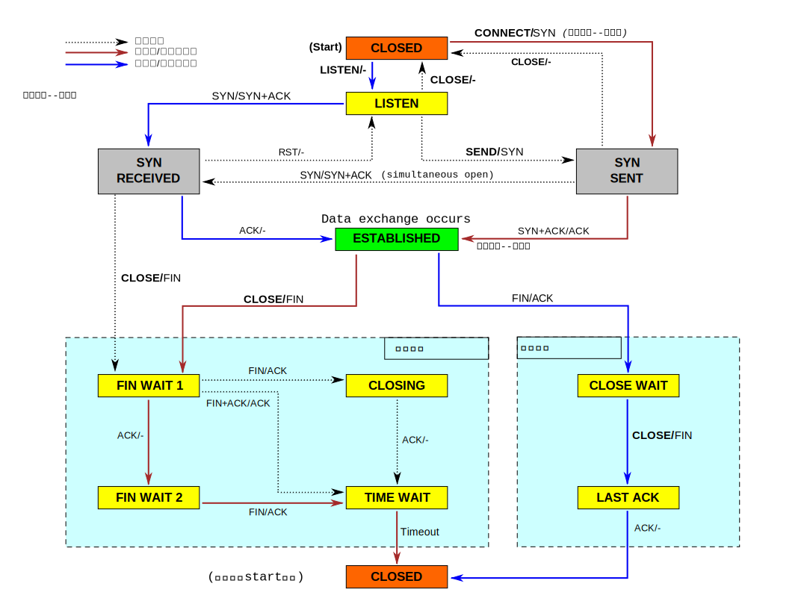

## # 关于TCP连接的TIME-WAIT状态，它是为何而生，存在的意义是什么？

当TCP连接关闭之前，首先发起关闭的一方会进入TIME-WAIT状态，另一方可以快速回收连接。

可以用 `ss -tan`来查看TCP 连接的当前状态

    ss -tan
    State      Recv-Q Send-Q                   Local Address:Port                                  Peer Address:Port         
    LISTEN     0      128                                  *:22                                               *:* 
    LISTEN     0      1                            127.0.0.1:32000                                            *:*    

参考
====
- [面试官：换人！他连 TCP 这几个参数都不懂](https://www.cxyxiaowu.com/10909.html)