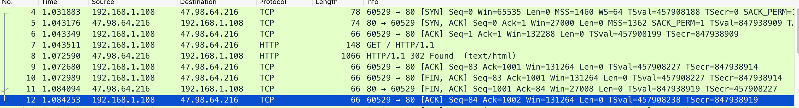

> [通俗大白话来理解TCP协议的三次握手和四次分手](https://github.com/jawil/blog/issues/14)

1.TCP建立连接，三次握手
---

建立的TCP连接可靠的连接，必须经过三次握手建立连接才能正式通信彼此传输数数据。

客户端请求服务端建立连接

第一次握手：客户给服务发送一个请求报文SYN, 客户端的状态置SYN_SENT状态

第二次握手：服务端在收到客户端发过来的SYN请求报文后，开始给客户端发送ACK报文和SYN报文，状态置为SYN_RECE

第三次握手：客户端口收到服务端口过来的SYN报文和ACK报文后，状态由原来的SYN_SENT状态变为ESTABLISHED；并且给服务发送一个ACK报文告知对方已经送到服务端发送的SYN报文，服务端收到报文后，由原来的SYN_RECE变为ESTABLISHED

至此客户到服务端，服务端到客户端的双向连接建立好了并且处理ESTABLISHED。双方可以进行数据交换了。

2.TCP断开连接，四次挥手。
---

当客户端把所有数据传送完毕的时候，给服务端口送一个FIN报文，告知服务端：我这边没有数据可传，希望关闭客户端到服务端方向的连接。之后其状态由原来的

ESTABLISHED 变为FIN_WAIT_1,；

服务端收到客户的FIN报文后，送一个ACK报文给客户端，告知“我服务端知道你客户端口已经没有数据可传，但是我这边什么关闭连接，还需要等我的数据传完；如果我这里数据也传送完了，我也会给发送一个FIN报文。”。此时服务端发送ACK报文后，状态由之前的ESTABLISHED 变为CLOSE_WAIT

客户端端收到服务的ACK报文，将FIN_WAIT_1置FIN_WAIT_2,同时，继续等来的服务发送FIN报文。

当服务端数据传送也完毕的后，开始给客户端发送FIN包，发送FIN包后，其状态CLOSE_WAIT置为LAST_ACK

客户端口收到了服务的发过来的FIN包后，又给服务端发送ACK。发送ACK后，状态由原来的FIN_WAIT_2置为TIME_WAIT，客户在经过2MSL 时间进入CLOSE状态

服务端口收到客户端发送的ACK后，由LAST_ACK也进入CLOSE

3.TCP迁移状态：
---

LISTEN:服务端已经启动一个socket,其状态处于监听状态，等待客户发起请求连接。

ESTABLISHED:客户端和服务端经过三次握手建立，两个方向上连接状态都建立，状态置为ESTABLISHED

客户端状态变迁：（主动端）

FIN_WAIT_1: 发送FIN给服务端口。

FIN_WAIT_2:收到服务端的ACK报文

TIME_WAIT :收到服务端发过来的FIN报文，发送ACK报文给服务端口。主动关闭连接端，接收到服务（TIME_WAIT是主动端关闭）之后进入2MSL时间的等待

CLOSE：2MSl过后，关闭进入初始化状态。

 

服务端状态变迁：（服务端）

CLOSE_WAIT：收到客户端FIN报文，给客户端发送ACK状态后，表示知道客户端要关闭连接请求，服务端可能数据还没有传送完，所以处于等待关闭状态。（CLOSE_WAIT是被动端关闭）

LAST_ACK：服务端数据传输完毕，发送FIN报文给客户端，同时等待客户端发ACK报文状态

CLOSE：收到客户端ACK报文后，进入初始化状态

 

连接是双方建立的。发送数据的端客户也转变为接受数据的服务端口，服务端和客户角色是相互转换的

4.MSL时间：
---

MSL就是`maximum segment lifetime`(最大分节生命期），这是一个IP数据包能在互联网上生存的最长时间，超过这个时间IP数据包将在网络中消失 。MSL在RFC 1122上建议是2分钟，而源自berkeley的TCP实现传统上使用30秒

TIME_WAIT状态维持时间

TIME_WAIT状态维持时间是两个MSL时间长度，也就是在1-4分钟。Windows操作系统就是4分钟。

5.用于统计当前各种状态的连接的数量的命令
---

    netstat -n | awk '/^tcp/ {++S[$NF]} END {for(a in S) print a, S[a]}'

返回结果如下：

    LAST_ACK 14
    SYN_RECV 348
    ESTABLISHED 70
    FIN_WAIT1 229
    FIN_WAIT2 30
    CLOSING 33
    TIME_WAIT 18122

案例解析
---

具体流程:

Client -> Server : [SYN]  ==> SYN = 1 , ACK = 0 
Server -> Client : [SYN,ACK] => SYN = 1, ACK = 1
Client -> Server : [ACK]  => ACK = 1 

**TCP 头部**

上面就是TCP协议头部的格式，由于它太重要了，是理解其它内容的基础，下面就将每个字段的信息都详细的说明一下。

- Source Port和Destination Port:分别占用16位，表示源端口号和目的端口号；用于区别主机中的不同进程，而IP地址是用来区分不同的主机的，源端口号和目的端口号配合上IP首部中的源IP地址和目的IP地址就能唯一的确定一个TCP连接；

- Sequence Number:用来标识从TCP发端向TCP收端发送的数据字节流，它表示在这个报文段中的的第一个数据字节在数据流中的序号；主要用来解决网络报乱序的问题；

- Acknowledgment Number:32位确认序列号包含发送确认的一端所期望收到的下一个序号，因此，确认序号应当是上次已成功收到数据字节序号加1。不过，只有当标志位中的ACK标志（下面介绍）为1时该确认序列号的字段才有效。主要用来解决不丢包的问题；

- Offset:给出首部中32 bit字的数目，需要这个值是因为任选字段的长度是可变的。这个字段占4bit（最多能表示15个32bit的的字，即4*15=60个字节的首部长度），因此TCP最多有60字节的首部。然而，没有任选字段，正常的长度是20字节；

- TCP Flags:TCP首部中有6个标志比特，它们中的多个可同时被设置为1，主要是用于操控TCP的状态机的，依次为URG，ACK，PSH，RST，SYN，FIN。每个标志位的意思如下：

    URG：此标志表示TCP包的紧急指针域（后面马上就要说到）有效，用来保证TCP连接不被中断，并且督促中间层设备要尽快处理这些数据；

    ACK：此标志表示应答域有效，就是说前面所说的TCP应答号将会包含在TCP数据包中；有两个取值：0和1，为1的时候表示应答域有效，反之为0；

    PSH：这个标志位表示Push操作。所谓Push操作就是指在数据包到达接收端以后，立即传送给应用程序，而不是在缓冲区中排队；

    RST：这个标志表示连接复位请求。用来复位那些产生错误的连接，也被用来拒绝错误和非法的数据包；

    SYN：表示同步序号，用来建立连接。SYN标志位和ACK标志位搭配使用，当连接请求的时候，SYN=1，ACK=0；连接被响应的时候，SYN=1，ACK=1；这个标志的数据包经常被用来进行端口扫描。扫描者发送一个只有SYN的数据包，如果对方主机响应了一个数据包回来 ，就表明这台主机存在这个端口；但是由于这种扫描方式只是进行TCP三次握手的第一次握手，因此这种扫描的成功表示被扫描的机器不很安全，一台安全的主机将会强制要求一个连接严格的进行TCP的三次握手；

    FIN： 表示发送端已经达到数据末尾，也就是说双方的数据传送完成，没有数据可以传送了，发送FIN标志位的TCP数据包后，连接将被断开。这个标志的数据包也经常被用于进行端口扫描。

**ACK ： TCP协议规定，只有ACK=1时有效，也规定连接建立后所有发送的报文的ACK必须为1**

**SYN(SYNchronization) ： 在连接建立时用来同步序号。当SYN=1而ACK=0时，表明这是一个连接请求报文。对方若同意建立连接，则应在响应报文中使SYN=1和ACK=1. 因此, SYN置1就表示这是一个连接请求或连接接受报文。**

**FIN （finis）即完，终结的意思， 用来释放一个连接。当 FIN = 1 时，表明此报文段的发送方的数据已经发送完毕，并要求释放连接。**

三次握手过程:

- 第一次握手：建立连接。客户端发送连接请求报文段，将SYN位置为1，Sequence Number为x；然后，客户端进入SYN_SEND状态，等待服务器的确认；
- 第二次握手：服务器收到SYN报文段。服务器收到客户端的SYN报文段，需要对这个SYN报文段进行确认，设置Acknowledgment Number为x+1(Sequence Number+1)；同时，自己自己还要发送SYN请求信息，将SYN位置为1，Sequence Number为y；服务器端将上述所有信息放到一个报文段（即SYN+ACK报文段）中，一并发送给客户端，此时服务器进入SYN_RECV状态；
- 第三次握手：客户端收到服务器的SYN+ACK报文段。然后将Acknowledgment Number设置为y+1，向服务器发送ACK报文段，这个报文段发送完毕以后，客户端和服务器端都进入ESTABLISHED状态，完成TCP三次握手。
完成了三次握手，客户端和服务器端就可以开始传送数据。以上就是TCP三次握手的总体介绍。

**那四次分手呢？**

当客户端和服务器通过三次握手建立了TCP连接以后，当数据传送完毕，肯定是要断开TCP连接的啊。那对于TCP的断开连接，这里就有了神秘的“四次分手”。

- 第一次分手：主机1（可以使客户端，也可以是服务器端），设置Sequence Number和Acknowledgment Number，向主机2发送一个FIN报文段；此时，主机1进入FIN_WAIT_1状态；这表示主机1没有数据要发送给主机2了；
- 第二次分手：主机2收到了主机1发送的FIN报文段，向主机1回一个ACK报文段，Acknowledgment Number为Sequence Number加1；主机1进入FIN_WAIT_2状态；主机2告诉主机1，我“同意”你的关闭请求；
- 第三次分手：主机2向主机1发送FIN报文段，请求关闭连接，同时主机2进入LAST_ACK状态；
- 第四次分手：主机1收到主机2发送的FIN报文段，向主机2发送ACK报文段，然后主机1进入TIME_WAIT状态；主机2收到主机1的ACK报文段以后，就关闭连接；此时，主机1等待2MSL后依然没有收到回复，则证明Server端已正常关闭，那好，主机1也可以关闭连接了。

注意上面的图,有时候我们抓取到的只有三次分手,这是服务器将 [ACK][FIN] 两次合并到了一起.