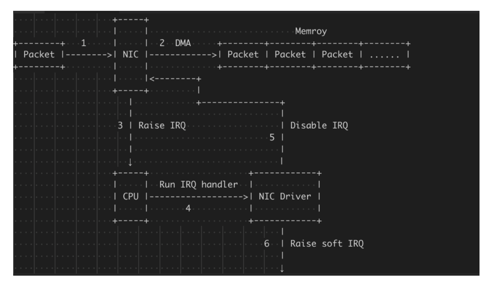
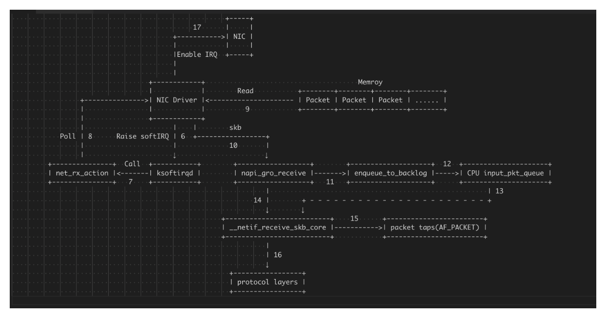

理解网卡混杂模式
===

网卡工作模式
===
网卡有以下几种工作模式，通常网卡会配置广播和多播模式：

- 广播模式（Broad Cast Model）:它的物理地址地址是 `0Xffffff` 的帧为广播帧，工作在广播模式的网卡接收广播帧。它将会接收所有目的地址为广播地址的数据包，一般所有的网卡都会设置为这个模式
- 多播传送（MultiCast Model）：多播传送地址作为目的物理地址的帧可以被组内的其它主机同时接收，而组外主机却接收不到。但是，如果将网卡设置为多播传送模式，它可以接收所有的多播传送帧，而不论它是不是组内成员。当数据包的目的地址为多播地址，而且网卡地址是属于那个多播地址所代表的多播组时，网卡将接纳此数据包，即使一个网卡并不是一个多播组的成员，程序也可以将网卡设置为多播模式而接收那些多播的数据包。
- 直接模式（Direct Model）:工作在直接模式下的网卡只接收目地址是自己 Mac 地址的帧。只有当数据包的目的地址为网卡自己的地址时，网卡才接收它。
- 混杂模式（Promiscuous Model）:工作在混杂模式下的网卡接收所有的流过网卡的帧，抓包程序就是在这种模式下运行的。网卡的缺省工作模式包含广播模式和直接模式，即它只接收广播帧和发给自己的帧。如果采用混杂模式，网卡将接受同一网络内所有所发送的数据包，这样就可以到达对于网络信息监视捕获的目的。它将接收所有经过的数据包，这个特性是编写网络监听程序的关键。


混杂模式（promiscuous mode）是计算机网络中的术语。是指一台机器的网卡能够接收所有经过它的数据流，而不论其目的地址是否是它。

> 一般计算机网卡都工作在非混杂模式下，此时网卡只接受来自网络端口的目的地址指向自己的数据。当网卡工作在混杂模式下时，网卡将来自接口的所有数据都捕获并交给相应的驱动程序。网卡的混杂模式一般在网络管理员分析网络数据作为网络故障诊断手段时用到，同时这个模式也被网络黑客利用来作为网络数据窃听的入口。在Linux操作系统中设置网卡混杂模式时需要管理员权限。在Windows操作系统和Linux操作系统中都有使用混杂模式的抓包工具，比如著名的开源软件Wireshark。


查看网卡是否开启混杂模式
===

```
[root@node1 21:06:51 ~]$ifconfig ens192
ens192: flags=4163<UP,BROADCAST,RUNNING,MULTICAST>  mtu 1500
        inet 192.168.17.88  netmask 255.255.240.0  broadcast 192.168.31.255
        inet6 fe80::20c:29ff:fe99:4eb2  prefixlen 64  scopeid 0x20<link>
        ether 00:0c:29:99:4e:b2  txqueuelen 1000  (Ethernet)
        RX packets 163692  bytes 10031607 (9.5 MiB)
        RX errors 0  dropped 110  overruns 0  frame 0
        TX packets 1751  bytes 175974 (171.8 KiB)
        TX errors 0  dropped 0 overruns 0  carrier 0  collisions 0

[root@node1 21:06:53 ~]$ifconfig ens192 promisc
[root@node1 21:06:57 ~]$ifconfig ens192
ens192: flags=4419<UP,BROADCAST,RUNNING,PROMISC,MULTICAST>  mtu 1500
        inet 192.168.17.88  netmask 255.255.240.0  broadcast 192.168.31.255
        inet6 fe80::20c:29ff:fe99:4eb2  prefixlen 64  scopeid 0x20<link>
        ether 00:0c:29:99:4e:b2  txqueuelen 1000  (Ethernet)
        RX packets 171193  bytes 10482754 (9.9 MiB)
        RX errors 0  dropped 110  overruns 0  frame 0
        TX packets 1776  bytes 179091 (174.8 KiB)
        TX errors 0  dropped 0 overruns 0  carrier 0  collisions 0
```


作用
==

如果在虚拟化场景下，就像我在开头提到的，往往需要在 vSwitch 上开启混杂模式用于开发测试。但是大部分开启混杂模式都是为了抓包。如果二层是使用的集线器，那么只要网卡打开了混杂模式，就可以接受到其他主机发送的数据包，如果二层使用的是交换机，那么往往需要在交换机上配置镜像模式才可以抓到包，这里是需要注意的。


抓包
==
关于 tcpdump 抓包和混杂模式的关系，这里引用wuyangchun博客的两个流程图来说明。




混杂模式是为了让数据包能够完成步骤 1，进入到 OS 中，tcpdump 真正抓到的包是在下图中的第 15 步。



参考
===
- [理解网卡混杂模式](https://zdyxry.github.io/2020/03/18/%E7%90%86%E8%A7%A3%E7%BD%91%E5%8D%A1%E6%B7%B7%E6%9D%82%E6%A8%A1%E5%BC%8F/)
