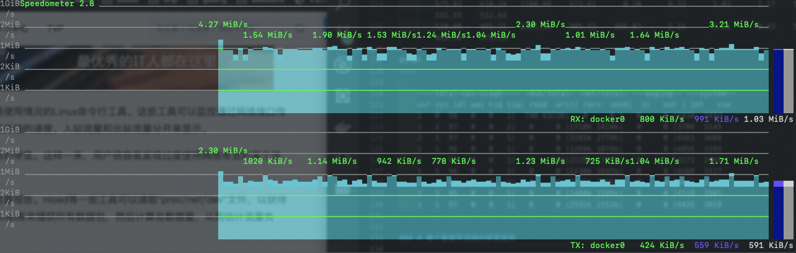
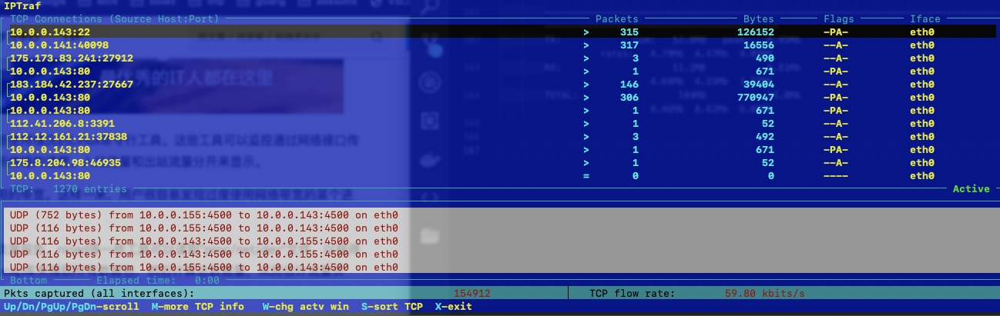
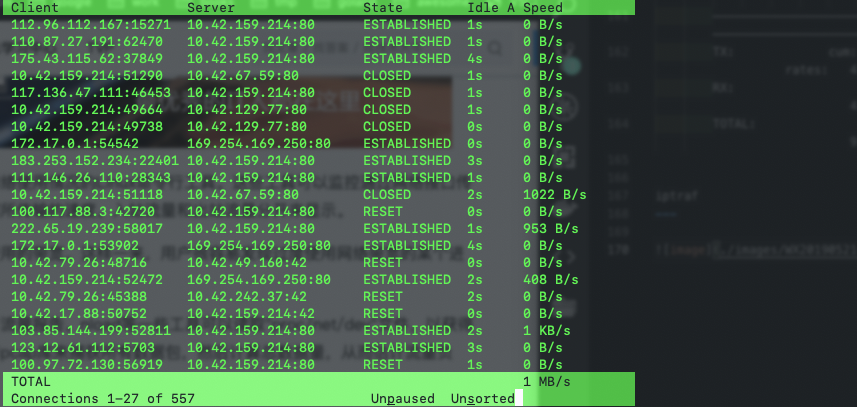

网络监控工具
----

### # 总体带宽监控

nload
---
> 可以通过上下选择网卡

    Device docker0 [172.17.0.1] (1/8):
    ======================================================================================
    Incoming:
                            #####|      |#         #|#..
                            ######|    .## .| #.   #####|   Curr: 6.66 MBit/s
                            #######   |### ##|##|########|  Avg: 9.42 MBit/s
                            #######. |####.###############  Min: 2.85 MBit/s
                            ########|#####################  Max: 20.98 MBit/s
                            ##############################  Ttl: 19453.50 GByte
    Outgoing:
                            ####
                            ####         |           .      Curr: 3.54 MBit/s
                            ####.       ##         . #|     Avg: 5.18 MBit/s
                            ######.     ## .. .   .#|##     Min: 1.58 MBit/s
                            #######  |####.#####|######||#  Max: 11.83 MBit/s
                            ########|#####################  Ttl: 10506.87 GByte

bmon
---

    docker0                                                                                                             bmon 3.8 
    ^   qdisc none (mq)            │      0         0      │ 577.79KiB   1.16K
        class :1 (mq)            │      0         0      │ 248.46KiB    551
            qdisc none (pfifo_fast)│      0         0      │ 248.46KiB    551
        class :2 (mq)            │      0         0      │ 329.33KiB    607
    >docker0                      │   1.13MiB   2.29K     │ 665.00KiB   1.14K
        qdisc none (noqueue)       │      0         0      │      0         0
        vethrf2d7fa1c1f            │    465B        6      │    698B       10
    ┴   qdisc none (noqueue)       │      0         0      │      0         0
    ───────────────────────────────┴───────────────────────┴──────────────────────────────────────────────────────────────────────
        MiB                      (RX Bytes/second)
        2.20 ...........................|................................
        1.84 ...........................|................................
        1.47 ...........|....|.....|....|.........|..|...................
        1.10 |...|.|....|....|.|||||..||||..||||..|..||..................
        0.73 |||||||||||||.||||||||||||||||.|||||||||||..................
        0.37 ||||||||||||||||||||||||||||||||||||||||||..................
            1   5   10   15   20   25   30   35   40   45   50   55   60
        MiB                      (TX Bytes/second)
        1.34 ...........................|................................
        1.12 ...........................|................................
        0.89 ......|....|....|.....|....|.........|......................
        0.67 ||..|.|....|....|.....|....||..||....|..||..................
        0.45 |||||||||||||.||||||||||||||||.|||||||||||..................
        0.22 ||||||||||||||||||||||||||||||||||||||||||..................
            1   5   10   15   20   25   30   35   40   45   50   55   60
    ──────────────────────────────────────────── Press d to enable detailed statistics ───────────────────────────────────────────
    ────────────────────────────────────────── Press i to enable additional information ────────────────────────────────────────

bwm-ng
---

        bwm-ng v0.6 (probing every 0.500s), press 'h' for help
        input: /proc/net/dev type: rate
        -         iface                   Rx                   Tx                Total
        ==============================================================================
                    lo:           0.00 KB/s            0.00 KB/s            0.00 KB/s
        vethrf2d7fa1c1f:           0.13 KB/s            0.32 KB/s            0.45 KB/s
        vethr0b8a22bc34:           0.08 KB/s            0.00 KB/s            0.08 KB/s
        vethr5acaffd3eb:         442.26 KB/s          441.13 KB/s          883.40 KB/s
        vethr408fa062fd:         407.15 KB/s          398.13 KB/s          805.28 KB/s
            veth0c3a5ad:           0.00 KB/s            0.08 KB/s            0.08 KB/s
                docker0:         824.09 KB/s          431.12 KB/s         1255.21 KB/s
                    eth0:         431.73 KB/s          450.36 KB/s          882.09 KB/s
        ------------------------------------------------------------------------------
                    total:        2105.45 KB/s         1721.14 KB/s         3826.59 KB/s 

cbm
---
    Color Bandwidth Meter

    Interface                      Receive                       Transmit                         Total
    lo                                0.00 B/s                       0.00 B/s                      0.00 B/s
    vethrf2d7fa1c1f                 287.61 B/s                     581.20 B/s                    868.81 B/s
    vethr0b8a22bc34                  41.94 B/s                       0.00 B/s                     41.94 B/s
    vethr5acaffd3eb                 544.09 kB/s                    543.53 kB/s                     1.09 MB/s
    vethr408fa062fd                 494.20 kB/s                    495.43 kB/s                   989.63 kB/s
    veth0c3a5ad                     137.81 B/s                     109.85 B/s                    247.66 B/s
    docker0                           1.01 MB/s                    532.15 kB/s                     1.54 MB/s

    Interface                                                    lo
    Address                                                      127.0.0.1

speedometer
---
> 运行比较慢

### # 监控总体带宽使用（批量式输出）

ifstat
---

            eth0              docker0           veth0c3a5ad       vethrf2d7fa1c1f     vethr5acaffd3eb     vethr0b8a22bc34     vethr408fa062fd  
        KB/s in  KB/s out   KB/s in  KB/s out   KB/s in  KB/s out   KB/s in  KB/s out   KB/s in  KB/s out   KB/s in  KB/s out   KB/s in  KB/s out
        475.90    486.17    918.28    506.88     31.28      1.68      0.98      1.05    488.62    516.77      0.04      0.00    424.33    439.80
        589.06    611.43   1133.14    596.81      8.90      0.72      0.21      0.43    602.37    609.87      0.04      0.00    553.16    546.33
        647.21    664.08   1615.06   1033.63    386.38      2.79      1.04      1.05    664.81   1047.91      0.04      0.00    596.05    598.87
        659.45    688.51   1261.09    657.70      0.13      0.11      0.21      0.43    673.40    672.86      0.04      0.00    620.97    613.55
        373.39    395.61    696.90    371.83      0.00      0.04      0.98      1.18    380.32    379.93      0.04      0.00    337.80    342.65
        332.69    344.10    605.33    333.51      2.46      2.19      0.54      0.74    336.92    336.48      0.04      0.00    286.07    304.26
        575.03    610.24   1100.08    573.61      0.20      0.33      1.03      1.17    587.96    587.41      0.04      0.00    541.55    532.64
        520.00    485.15   1301.23    905.52    386.07      2.15      0.21      0.43    530.18    913.83      0.04      0.00    412.59    478.19

dstat
----

    ----total-cpu-usage---- -dsk/total- -net/total- ---paging-- ---system--
    usr sys idl wai hiq siq| read  writ| recv  send|  in   out | int   csw 
    1   0  98   0   0   1|  74B 6323B|   0     0 |   0     0 |2830  2437 
    1   1  97   0   0   2|   0     0 |1710k 1424k|   0     0 |3786  3145 
    2   1  97   0   0   1|   0     0 |3205k 2778k|   0     0 |4561  3608 
    2   1  96   0   0   1|   0     0 |1269k 1078k|   0     0 |4056  3395 
    2   1  96   0   0   1|   0    60k|2129k 1771k|   0     0 |4171  2965 
    1   1  96   0   0   2|   0     0 |2230k 1845k|   0     0 |4168  3127 
    1   1  96   0   0   1|   0     0 |2531k 2096k|   0     0 |4433  3148 
    3   1  95   0   0   1|   0     0 |2480k 2195k|   0     0 |4118  3501 
    1   1  97   0   0   1|   0     0 |2592k 2152k|   0     0 |4435  3018

### # 每个套接字连接的带宽使用

                                        1.91Mb                           3.81Mb                           5.72Mb                           7.63Mb                     9.54Mb
        └───────────────────────────────┴────────────────────────────────┴────────────────────────────────┴────────────────────────────────┴────────────────────────────────
        lb-pro                                                               => 10.0.0.154                                                            187Kb   185Kb   163Kb
                                                                            <=                                                                      1.02Mb  1.19Mb   776Kb
        lb-pro                                                               => 10.0.0.155                                                            161Kb   162Kb   151Kb
                                                                            <=                                                                       696Kb   745Kb   614Kb
        lb-pro                                                               => 10.0.0.149                                                            149Kb   150Kb   145Kb
                                                                            <=                                                                       686Kb   716Kb   713Kb
        lb-pro                                                               => 10.0.0.152                                                            177Kb   157Kb   159Kb
                                                                            <=                                                                       900Kb   687Kb   710Kb
        lb-pro                                                               => 10.0.0.153                                                            182Kb   151Kb   163Kb
                                                                            <=                                                                       988Kb   629Kb   787Kb
        lb-pro                                                               => 111.19.61.13                                                            0b    412Kb   106Kb
                                                                            <=                                                                         0b   13.9Kb  4.02Kb
        lb-pro                                                               => 183.184.42.237                                                        376Kb   382Kb   386Kb
                                                                            <=                                                                      19.0Kb  19.9Kb  19.3Kb
        lb-pro                                                               => 223.74.249.157                                                        377Kb   377Kb   377Kb
                                                                            <=                                                                      17.4Kb  17.2Kb  17.2Kb
        lb-pro                                                               => 113.67.231.11                                                         357Kb   215Kb   188Kb
                                                                            <=                                                                      10.9Kb  10.5Kb  9.81Kb
        ────────────────────────────────────────────────────────────────────────────────────────────────────────────────────────────────────────────────────────────────────
        TX:             cum:   52.8MB   peak:   6.95Mb                                                                                      rates:   4.79Mb  4.47Mb  4.09Mb
        RX:                    51.1MB           6.81Mb                                                                                               4.68Mb  4.35Mb  3.97Mb
        TOTAL:                  104MB           13.8Mb                                                                                               9.46Mb  8.82Mb  8.05Mb

iptraf
---

tcptrack
---

### # 每个进程的带宽使用

nethogs
---
> 监听 docker 类的网卡会出现找不到进程问题

        PID USER     PROGRAM                                                                                                                                                                    DEV        SENT      RECEIVED       
            ? root     10.0.0.143:80-117.136.28.8:17365                                                                                                                                                    525.080      66.007 KB/sec
            ? root     10.0.0.143:443-100.117.86.130:15707                                                                                                                                                   0.289       0.805 KB/sec
            ? root     10.0.0.143:22122-100.97.72.128:59689                                                                                                                                                  0.275       0.764 KB/sec
        9882 root     /usr/local/aegis/aegis_client/aegis_10_65/AliYunDun                                                                                                                        eth0      13.903       0.341 KB/sec
        4316 root     /var/lib/cattle/pyagent/agent                                                                                                                                              eth0       0.234       0.240 KB/sec
            ? root     10.0.0.143:43508-10.0.0.141:8080                                                                                                                                                      0.094       0.084 KB/sec
            ? root     10.0.0.143:40850-10.0.0.141:8080                                                                                                                                                      0.094       0.084 KB/sec
        18516 root     sshd: root@pts/1                                                                                                                                                           eth0       1.950       0.071 KB/sec
            ? root     223.74.180.84:44609-10.42.159.214:80                                                                                                                                                  0.000       0.000 KB/sec
            ? root     183.25.179.154:34802-10.42.159.214:80                                                                                                                                                 0.000       0.000 KB/sec
            ? root     1.181.239.19:11741-10.42.159.214:80                                                                                                                                                   0.000       0.000 KB/se