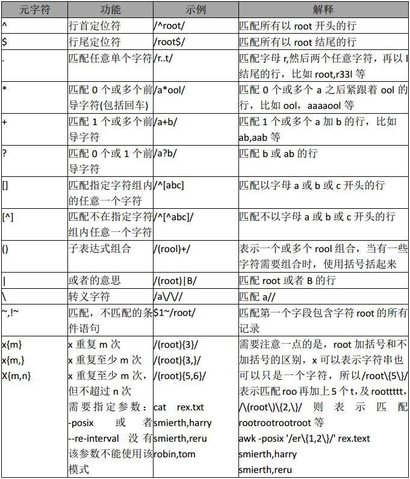

> awk是一种编程语言，用于在linux/unix下对文本和数据进行处理。数据可以来自标准输入(stdin)、一个或多个文件，或其它命令的输出。它支持用户自定义函数和动态正则表达式等先进功能，是linux/unix下的一个强大编程工具。它在命令行中使用，但更多是作为脚本来使用。awk有很多内建的功能，比如数组、函数等，这是它和C语言的相同之处，灵活性是awk最大的优势。

> [参考](http://man.linuxde.net/awk)


awk命令格式和选项
---
语法形式

    awk [options] 'script' var=value file(s)
    awk [options] -f scriptfile var=value file(s)

常用命令选项
---

    -F fs   fs指定输入分隔符，fs可以是字符串或正则表达式，(默认空格)如-F:
    -v var=value   赋值一个用户定义变量，将外部变量传递给 awk
    -f scripfile  从脚本文件中读取awk命令
    -m[fr] val   对val值设置内在限制，-mf选项限制分配给val的最大块数目；-mr选项限制记录的最大数目。这两个功能是Bell实验室版awk的扩展功能，在标准awk中不适用。

awk 模式
----

- /正则表达式/：使用通配符的扩展集。
- 关系表达式：使用运算符进行操作，可以是字符串或数字的比较测试。
- 模式匹配表达式：用运算符~（匹配）和~!（不匹配）。
- BEGIN语句块、pattern语句块、END语句块：参见awk的工作原理


awk的工作原理
--
> awk 'BEGIN{ commands } pattern{ commands } END{ commands }'


- 第一步：执行`BEGIN{ commands }`语句块中的语句；
- 第二步：从文件或标准输入(stdin)读取一行，然后执行`pattern{ commands }`语句块，它逐行扫描文件，从第一行到最后一行重复这个过程，直到文件全部被读取完毕。
- 第三步：当读至输入流末尾时，执行END{ commands }语句块。

**BEGIN**语句块在awk开始从输入流中读取行之前被执行，这是一个可选的语句块，比如变量初始化、打印输出表格的表头等语句通常可以写在BEGIN语句块中。

**END**语句块在awk从输入流中读取完所有的行之后即被执行，比如打印所有行的分析结果这类信息汇总都是在END语句块中完成，它也是一个可选语句块。

**pattern**语句块中的通用命令是最重要的部分，它也是可选的。如果没有提供pattern语句块，则默认执行{ print }，即打印每一个读取到的行，awk读取的每一行都会执行该语句块。


- print 以逗号分个时,参数以空格定界
- 使用 `""` 作为拼接符


    $ echo | awk '{var1 = "v1";var2="v2"; print var1,var2}'
    v1 v2
    $ echo | awk '{var1 = "v1";var2="v2"; print var1"<<<<>>>>>"var2}'
    v1<<<<>>>>>v2


awk内置变量（预定义变量）
---
说明：`[A][N][P][G]表示第一个支持变量的工具，[A]=awk、[N]=nawk、[P]=POSIXawk、[G]=gawk`

    $n 当前记录的第n个字段，比如n为1表示第一个字段，n为2表示第二个字段。 
    $0 这个变量包含执行过程中当前行的文本内容。
    NF 表示字段数，在执行过程中对应于当前的字段数。
    $NF 显示当前字符串
    NR 显示当前行号
    
    ### 可以使用 -v 引入需要修改的变量,来修改awk 运行行为
    [N] ARGC 命令行参数的数目。
    [G] ARGIND 命令行中当前文件的位置（从0开始算）。
    [N] ARGV 包含命令行参数的数组。
    [G] CONVFMT 数字转换格式（默认值为%.6g）。
    [P] ENVIRON 环境变量关联数组。
    [N] ERRNO 最后一个系统错误的描述。
    [G] FIELDWIDTHS 字段宽度列表（用空格键分隔）。
    [A] FILENAME 当前输入文件的名。
    [P] FNR 同NR，但相对于当前文件。
    [A] FS 字段分隔符（默认是任何空格）。
    [G] IGNORECASE 如果为真，则进行忽略大小写的匹配。
    [A] NF 表示字段数，在执行过程中对应于当前的字段数。
    [A] NR 表示记录数，在执行过程中对应于当前的行号。
    [A] OFMT 数字的输出格式（默认值是%.6g）。
    [A] OFS 输出字段分隔符（默认值是一个空格）。
    [A] ORS 输出记录分隔符（默认值是一个换行符）。
    [A] RS 记录分隔符（默认是一个换行符）。
    [N] RSTART 由match函数所匹配的字符串的第一个位置。
    [N] RLENGTH 由match函数所匹配的字符串的长度。
    [N] SUBSEP 数组下标分隔符（默认值是34）。

    使用例子(不需要 $ 符号):
    awk -F: 'NF >= 7 {print NR,$0}' /etc/passwd


awk 常用内建函数
----

- index(string,search_string):返回search_string在string中出现的位置

- sub(regex,replacement_str,string):将正则匹配到的第一处内容替换为replacement_str;

- match(regex,string):检查正则表达式是否能够匹配字符串；

- length(string)：返回字符串长度


    echo | awk 


> getline 命令是 awk 当中非常强大的一个功能

getline命令执行后，awk会设置NF，NR，FNR和$0等这些内部变量。
    
    # 获取偶数
    # 总行数必须为偶数,否则,将强制携带最后一条数据,
    # 例如: seq 9 | awk '{getline; print $0}' 
    # 将显示 9
    seq 10 | awk '{getline; print $0}'
    2
    4
    6
    8
    10
    
那么getline究竟是实现什么功能呢？正如getline的翻译，得到行，但是注意，得到的并不是当前行，而是当前行的下一行。以上面的例子来分析，awk首先读取到了第一行，就是1，然后getline，就得到了1下面的第二行，就是2，因为getline之后，awk会改变对应的NF，NR，FNR和$0等内部变量，所以此时的$0的值就不再是1，而是2了，然后将它打印出来

> getline 获取当前行的下一行

    # 获取奇数
    seq 10 | awk '{print $0;getline}'
    1
    3
    5
    7
    9

打印偶数行的唯一区别就是`print $0`和 `getline` 的顺序不一样。因为 `getline` 在`print $0`之后，此时的`$0`仍然是第一行。然后`getline`，`$0`变成了下一行2。依次类推，就打印出了奇数行。


getline也可以用来执行一个UNIX命令，并得到它的输出。下面例子通过getline得到系统的当前时间

    $ awk 'BEGIN {"date" | getline; print $0}'
    Sun Aug 19 10:19:24 CST 2018


示例
----

打印每一行的第二和第三个字段：

```bash
awk '{ print $2,$3 }' filename
```

    
统计文件中的行数：

```bash
awk 'END{ print NR }' filename
```

以上命令只使用了END语句块，在读入每一行的时，awk会将NR更新为对应的行号，当到达最后一行NR的值就是最后一行的行号，所以END语句块中的NR就是文件的行数。

一个每一行中第一个字段值累加的例子：

```bash
seq 5 | awk 'BEGIN{ sum=0; print "总和：" } { print $1"+"; sum+=$1 } END{ print "等于"; print sum }' 
# 总和：
# 1+
# 2+
# 3+
# 4+
# 5+
# 等于
# 15
```
传递外部变量


```bash
var=1000
echo | awk '{print vara}' vara=$var #  输入来自stdin
awk '{print vara}' vara=$var file # 输入来自文件
```

用样式对awk处理的行进行过滤

    awk 'NR < 5' #行号小于5
    awk 'NR==1,NR==4 {print}' file #行号等于1和4的打印出来
    awk '/linux/' #包含linux文本的行（可以用正则表达式来指定，超级强大）
    awk '!/linux/' #不包含linux文本的行
    
    seq 100 | awk '$NF > 10 {print $0}' # 过滤大于10的数据

设置定界符 :使用-F来设置定界符（默认为空格）:

    awk -F: '{print NF}' /etc/passwd   //显示每行有多少字段
    awk -F: '{print $NF}' /etc/passwd  //将每行第NF个字段的值打印出来

读取命令输出: 使用getline，将外部shell命令的输出读入到变量cmdout中:

```bash
echo | awk '{"grep root /etc/passwd" | getline cmdout; print cmdout }'
```

awk 正则表达式

```bash
# data.csv
"first", "second", "last"
"fir,st", "second", "last"
"firtst one", "sec,ond field", "final,ly"
# 删除
awk -v FS ='“，”| ^“|”$''{print $ 2“###”$ 3“###”$ 4}'data.csv
```


-v 表示将 FS 这个变量引入到 awk 里面使用

- ", "	matches the area between the datafields
- ^"	matches the area left of the first datafield
- "$	matches the area right of the last data field


表格输出

```bash
## data2.csv
Marry   2143 78 84 77
Jack    2321 66 78 45
Tom     2122 48 77 71
Mike    2537 87 97 95
Bob     2415 40 57 62

## 输出表格
awk 'BEGIN{
    math=0;
    eng=0;
    com=0;
    printf "Lineno.   Name    No.    Math   English   Computer    Total\n";
    printf "------------------------------------------------------------\n"
}{
    math+=$3; 
    eng+=$4; 
    com+=$5;
    printf "%-8s %-7s %-7s %-7s %-9s %-10s %-7s \n",NR,$1,$2,$3,$4,$5,$3+$4+$5
} END{
    printf "------------------------------------------------------------\n";
    printf "%-24s %-7s %-9s %-20s \n","Total:",math,eng,com;
    printf "%-24s %-7s %-9s %-20s \n","Avg:",math/NR,eng/NR,com/NR
}' data2.csv

```

统计`netstat -anp` 状态为 `LISTEN` 和 `CONNECT` 的连接数量分别是多少

```bash
# 如果自定义字段, ~ 符号必须有
# 如果针对整个一行,则可以写成  /LISTEN|CONNECTED/ 表示包含 LISTEN 或 CONNECTED
netstat -anp | awk '$6~/LISTEN|CONNECTED/{sum[$6]++} END{for (i in sum) printf "%-10s %-6s %-3s \n", i," ",sum[i]}'
```


统计 `/home` 目录下不同用户的普通文件的总数是多少？

```bash
ls -l | awk 'NR!=1 && !/^d/{sum[$3]++} END{for (i in sum) printf "%-6s %-5s %-3s \n",i," ",sum[i]}'   
mysql        199 
root         374
``` 

统计 `/home` 目录下不同用户的普通文件的大小总size是多少？

```bash
ls -l | awk 'NR!=1 && !/^d/{sum[$3]+=$5} END{for(i in sum) printf "%-6s %-5s %.3s %-2s \n",i," ",sum[i]/1024/1024,"MB"}'
```

输出匹配的行的信息

```bash
awk '/ro{1,3}/{print}' /etc/passwd
#或者
awk '/ro{1,3}/{print $0}' /etc/passwd
```

awk逻辑运算符

```bash
# print 使用()来输出多个变量
awk 'BEGIN{a=1;b=2;print (a>2&&b>1,a=1||b>1)}'
# 0 1
```

awk正则运算符


```bash
# awk 'BEGIN{a="100testaa";if(a~/100/) {print "ok"}}'
# ok
# 或者
echo|awk 'BEGIN{a="100testaaa"}a~/test/{print "ok"}'
# ok
```

第二个表达式,必须使用 echo 输出一个空白信息,让 awk 接收,否则 awk 将一直卡在那里

awk 使用不同字符分割

```bash
# 使用`" "` 或者 `:` 作为分割符号
awk -F '[" ":]+' '{print $1"--"$2"--"$3}' data2.csv
```
取 `data2.csv` 第2~4行的数据,输出行号,和内容

```bash
awk 'NR>=2 && NR<=4 {print NR" "$0}' data2.csv
``` 

输出 IP

```bash
ifconfig enp0s8 | awk -F '[" ":]+' 'NR==2{print $4}'
# 或者
ip addr show eth0 | awk -F '[" ":/]+' 'NR==3{print $3}'
```


**正则**



参考
====
- [Linux三剑客之awk命令](https://www.cnblogs.com/ginvip/p/6352157.html)
