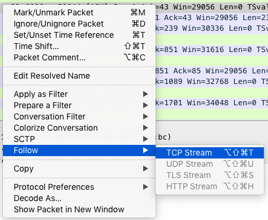
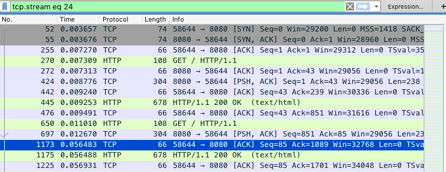
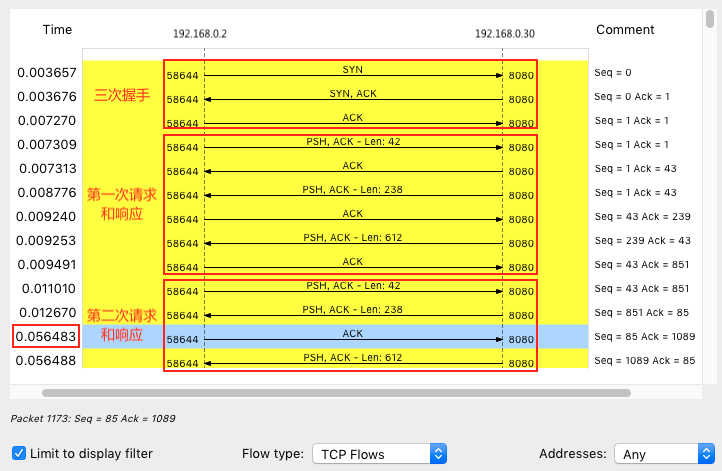
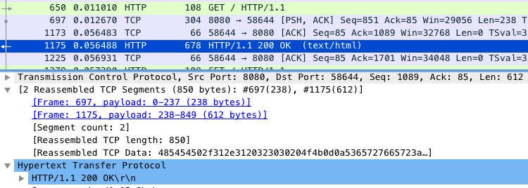
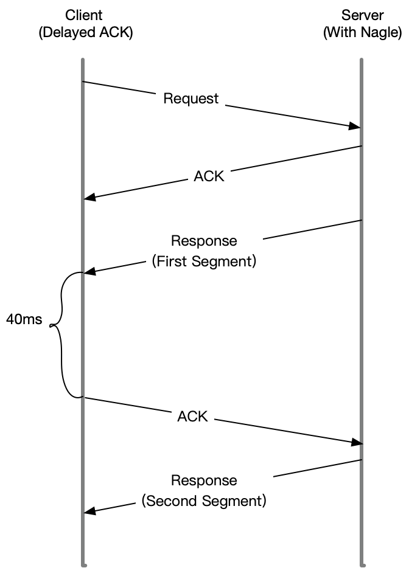
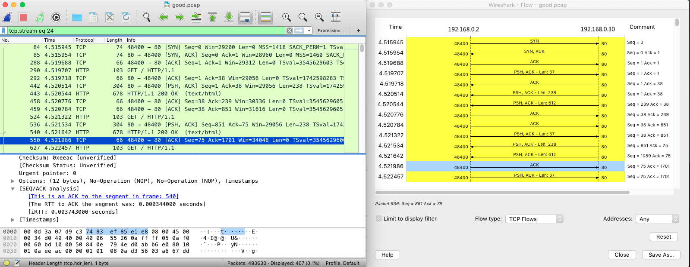

40 | 案例篇：网络请求延迟变大了，我该怎么办？
---

ddos 分布式,大流量,难追踪等特点,目前确实还没有办法,能够抵御 ddos 带来的影响.

比如我们可以购买专门的流量清洗设备和网络防火墙,在网络入口处阻断恶意流量，只保留正常流量进入数据中心的服务器。

除了 DDoS 会带来网络延迟增大外，我想，你肯定见到过不少其他原因导致的网络延迟，比如

- 网络传输慢，导致延迟；
- Linux 内核协议栈报文处理慢，导致延迟；
- 应用程序数据处理慢，导致延迟等等。

网络延迟
---

我相信，提到网络延迟时，你可能轻松想起它的含义——网络数据传输所用的时间。不过要注意，这个时间可能是单向的，指从源地址发送到目的地址的单程时间；也可能是双向的，即从源地址发送到目的地址，然后又从目的地址发回响应，这个往返全程所用的时间。

通常，我们更常用的是双向的往返通信延迟，比如 ping 测试的结果，就是往返延时 RTT（Round-Trip Time）。

除了网络延迟外，另一个常用的指标是应用程序延迟，它是指，从应用程序接收到请求，再到发回响应，全程所用的时间。通常，应用程序延迟也指的是往返延迟，是网络数据传输时间加上数据处理时间的和。

在 Linux 网络基础篇 中，我曾经介绍到，你可以用 ping 来测试网络延迟。ping 基于 ICMP 协议，它通过计算 ICMP 回显响应报文与 ICMP 回显请求报文的时间差，来获得往返延时。这个过程并不需要特殊认证，常被很多网络攻击利用，比如端口扫描工具 nmap、组包工具 hping3 等等。

所以，为了避免这些问题，很多网络服务会把 ICMP 禁止掉，这也就导致我们无法用 ping ，来测试网络服务的可用性和往返延时。这时，你可以用 traceroute 或 hping3 的 TCP 和 UDP 模式，来获取网络延迟。

比如，以 baidu.com 为例，你可以执行下面的 hping3 命令，测试你的机器到百度搜索服务器的网络延迟：

    # -c 表示发送 3 次请求，-S 表示设置 TCP SYN，-p 表示端口号为 80
    $ hping3 -c 3 -S -p 80 baidu.com
    HPING baidu.com (eth0 123.125.115.110): S set, 40 headers + 0 data bytes
    len=46 ip=123.125.115.110 ttl=51 id=47908 sport=80 flags=SA seq=0 win=8192 rtt=20.9 ms
    len=46 ip=123.125.115.110 ttl=51 id=6788  sport=80 flags=SA seq=1 win=8192 rtt=20.9 ms
    len=46 ip=123.125.115.110 ttl=51 id=37699 sport=80 flags=SA seq=2 win=8192 rtt=20.9 ms
    --- baidu.com hping statistic ---
    3 packets transmitted, 3 packets received, 0% packet loss
    round-trip min/avg/max = 20.9/20.9/20.9 ms

当然，我们用 traceroute ，也可以得到类似结果：

    # --tcp 表示使用 TCP 协议，-p 表示端口号，-n 表示不对结果中的 IP 地址执行反向域名解析
    $ traceroute --tcp -p 80 -n baidu.com
    traceroute to baidu.com (123.125.115.110), 30 hops max, 60 byte packets
    1  * * *
    2  * * *
    3  * * *
    4  * * *
    5  * * *
    6  * * *
    7  * * *
    8  * * *
    9  * * *
    10  * * *
    11  * * *
    12  * * *
    13  * * *
    14  123.125.115.110  20.684 ms *  20.798 ms

traceroute 会在路由的每一跳发送三个包，并在收到响应后，输出往返延时。如果无响应或者响应超时（默认 5s），就会输出一个星号。

案例
---

    docker run --network=host --name=good -itd nginx
    fb4ed7cb9177d10e270f8320a7fb64717eac3451114c9fab3c50e02be2e88ba2

继续在终端一中，执行下面的命令，运行案例应用，它会监听 8080 端口：

    docker run --name nginx --network=host -itd feisky/nginx:latency
    b99bd136dcfd907747d9c803fdc0255e578bad6d66f4e9c32b826d75b6812724

hping3 测试延迟

    # 测试 80 端口延迟
    $ hping3 -c 3 -S -p 80 192.168.0.30
    HPING 192.168.0.30 (eth0 192.168.0.30): S set, 40 headers + 0 data bytes
    len=44 ip=192.168.0.30 ttl=64 DF id=0 sport=80 flags=SA seq=0 win=29200 rtt=7.8 ms
    len=44 ip=192.168.0.30 ttl=64 DF id=0 sport=80 flags=SA seq=1 win=29200 rtt=7.7 ms
    len=44 ip=192.168.0.30 ttl=64 DF id=0 sport=80 flags=SA seq=2 win=29200 rtt=7.6 ms

    --- 192.168.0.30 hping statistic ---
    3 packets transmitted, 3 packets received, 0% packet loss
    round-trip min/avg/max = 7.6/7.7/7.8 ms

    # 测试 8080 端口延迟
    $ hping3 -c 3 -S -p 8080 192.168.0.30
    HPING 192.168.0.30 (eth0 192.168.0.30): S set, 40 headers + 0 data bytes
    len=44 ip=192.168.0.30 ttl=64 DF id=0 sport=8080 flags=SA seq=0 win=29200 rtt=7.7 ms
    len=44 ip=192.168.0.30 ttl=64 DF id=0 sport=8080 flags=SA seq=1 win=29200 rtt=7.6 ms
    len=44 ip=192.168.0.30 ttl=64 DF id=0 sport=8080 flags=SA seq=2 win=29200 rtt=7.3 ms

    --- 192.168.0.30 hping statistic ---
    3 packets transmitted, 3 packets received, 0% packet loss
    round-trip min/avg/max = 7.3/7.6/7.7 ms

从这个输出你可以看到，两个端口的延迟差不多，都是 7ms。不过，这只是单个请求的情况。换成并发请求的话，又会怎么样呢？接下来，我们就用 wrk 试试。

这次在终端二中，执行下面的新命令，分别测试案例机器并发 100 时， 80 端口和 8080 端口的性能：

    # 测试 80 端口性能
    $ # wrk --latency -c 100 -t 2 --timeout 2 http://192.168.0.30/
    Running 10s test @ http://192.168.0.30/
    2 threads and 100 connections
    Thread Stats   Avg      Stdev     Max   +/- Stdev
        Latency     9.19ms   12.32ms 319.61ms   97.80%
        Req/Sec     6.20k   426.80     8.25k    85.50%
    Latency Distribution
        50%    7.78ms
        75%    8.22ms
        90%    9.14ms
        99%   50.53ms
    123558 requests in 10.01s, 100.15MB read
    Requests/sec:  12340.91
    Transfer/sec:     10.00MB

    # 测试 8080 端口性能
    $ wrk --latency -c 100 -t 2 --timeout 2 http://192.168.0.30:8080/
    Running 10s test @ http://192.168.0.30:8080/
    2 threads and 100 connections
    Thread Stats   Avg      Stdev     Max   +/- Stdev
        Latency    43.60ms    6.41ms  56.58ms   97.06%
        Req/Sec     1.15k   120.29     1.92k    88.50%
    Latency Distribution
        50%   44.02ms
        75%   44.33ms
        90%   47.62ms
        99%   48.88ms
    22853 requests in 10.01s, 18.55MB read
    Requests/sec:   2283.31
    Transfer/sec:      1.85MB

从上面两个输出可以看到，官方 Nginx（监听在 80 端口）的平均延迟是 9.19ms，而案例 Nginx 的平均延迟（监听在 8080 端口）则是 43.6ms。从延迟的分布上来看，官方 Nginx 90% 的请求，都可以在 9ms 以内完成；而案例 Nginx 50% 的请求，就已经达到了 44 ms。

再结合上面 hping3 的输出，我们很容易发现，案例 Nginx 在并发请求下的延迟增大了很多，这是怎么回事呢？

这里我们可以利用 tcpdump 抓包,并且保存到 pcap 文件当中,可以使用 wireshark 打开

    # 抓包
    tcpdump -nn tcp port 8080 -w nginx.pcap
    # 测试 8080 端口性能
    $ wrk --latency -c 100 -t 2 --timeout 2 http://192.168.0.30:8080/
    
当 wrk 命令结束后,再次切换回终端一,并且按下 Ctrl+C 结束 tcpdump 命令.然后,再把抓取到的 nginx.pcap,复制到装有 wireshark 机器中,并且打开.

由于网络包的数量比较多，我们可以先过滤一下。比如，在选择一个包后，你可以单击右键并选择 “Follow” -> “TCP Stream”，如下图所示：

然后，关闭弹出来的对话框，回到 Wireshark 主窗口。这时候，你会发现 Wireshark 已经自动帮你设置了一个过滤表达式 tcp.stream eq 24。如下图所示（图中省去了源和目的 IP 地址）：

从这里，你可以看到这个 TCP 连接从三次握手开始的每个请求和响应情况。当然，这可能还不够直观，你可以继续点击菜单栏里的 Statics -> Flow Graph，选中 “Limit to display filter” 并设置 Flow type 为 “TCP Flows”：

注意，这个图的左边是客户端，而右边是 Nginx 服务器。通过这个图就可以看出，前面三次握手，以及第一次 HTTP 请求和响应还是挺快的，但第二次 HTTP 请求就比较慢了，特别是客户端在收到服务器第一个分组后，40ms 后才发出了 ACK 响应（图中蓝色行）。

看到 40ms 这个值，你有没有想起什么东西呢？实际上，这是 TCP 延迟确认（Delayed ACK）的最小超时时间。

这里我解释一下延迟确认。这是针对 TCP ACK 的一种优化机制，也就是说，不用每次请求都发送一个 ACK，而是先等一会儿（比如 40ms），看看有没有“顺风车”。如果这段时间内，正好有其他包需要发送，那就捎带着 ACK 一起发送过去。当然，如果一直等不到其他包，那就超时后单独发送 ACK。

因为案例中 40ms 发生在客户端上，我们有理由怀疑，是客户端开启了延迟确认机制。而这儿的客户端，实际上就是前面运行的 wrk。

查询 TCP 文档（执行 man tcp），你就会发现，只有 TCP 套接字专门设置了 TCP_QUICKACK ，才会开启快速确认模式；否则，默认情况下，采用的就是延迟确认机制：

    TCP_QUICKACK (since Linux 2.4.4)
              Enable  quickack mode if set or disable quickack mode if cleared.  In quickack mode, acks are sent imme‐
              diately, rather than delayed if needed in accordance to normal TCP operation.  This flag is  not  perma‐
              nent,  it only enables a switch to or from quickack mode.  Subsequent operation of the TCP protocol will
              once again enter/leave quickack mode depending on internal  protocol  processing  and  factors  such  as
              delayed ack timeouts occurring and data transfer.  This option should not be used in code intended to be
              portable.

为了验证我们的猜想，确认 wrk 的行为，我们可以用 strace ，来观察 wrk 为套接字设置了哪些 TCP 选项。

比如，你可以切换到终端二中，执行下面的命令：

    $ strace -f wrk --latency -c 100 -t 2 --timeout 2 http://192.168.0.30:8080/
    ...
    setsockopt(52, SOL_TCP, TCP_NODELAY, [1], 4) = 0
    ...

这样，你可以看到，wrk 只设置了 TCP_NODELAY 选项，而没有设置 TCP_QUICKACK。这说明 wrk 采用的正是延迟确认，也就解释了上面这个 40ms 的问题。

不过，别忘了，这只是客户端的行为，按理来说，Nginx 服务器不应该受到这个行为的影响。那是不是我们分析网络包时，漏掉了什么线索呢？让我们回到 Wireshark 重新观察一下。

仔细观察 Wireshark 的界面，其中， 1173 号包，就是刚才说到的延迟 ACK 包；下一行的 1175 ，则是 Nginx 发送的第二个分组包，它跟 697 号包组合起来，构成一个完整的 HTTP 响应（ACK 号都是 85）。

第二个分组没跟前一个分组（697 号）一起发送，而是等到客户端对第一个分组的 ACK 后（1173 号）才发送，这看起来跟延迟确认有点像，只不过，这儿不再是 ACK，而是发送数据。

看到这里，我估计你想起了一个东西—— Nagle 算法（纳格算法）。进一步分析案例前，我先简单介绍一下这个算法。

Nagle 算法，是 TCP 协议中用于减少小包发送数量的一种优化算法，目的是为了提高实际带宽的利用率。

举个例子，当有效负载只有 1 字节时，再加上 TCP 头部和 IP 头部分别占用的 20 字节，整个网络包就是 41 字节，这样实际带宽的利用率只有 2.4%（1/41）。往大了说，如果整个网络带宽都被这种小包占满，那整个网络的有效利用率就太低了。

Nagle 算法正是为了解决这个问题。它通过合并 TCP 小包，提高网络带宽的利用率。Nagle 算法规定，一个 TCP 连接上，最多只能有一个未被确认的未完成分组；在收到这个分组的 ACK 前，不发送其他分组。这些小分组会被组合起来，并在收到 ACK 后，用同一个分组发送出去。

显然，Nagle 算法本身的想法还是挺好的，但是知道 Linux 默认的延迟确认机制后，你应该就不这么想了。因为它们一起使用时，网络延迟会明显。如下图所示：

- 当 Sever 发送了第一个分组后，由于 Client 开启了延迟确认，就需要等待 40ms 后才会回复 ACK。
- 同时，由于 Server 端开启了 Nagle，而这时还没收到第一个分组的 ACK，Server 也会在这里一直等着。
- 直到 40ms 超时后，Client 才会回复 ACK，然后，Server 才会继续发送第二个分组。

既然可能是 Nagle 的问题，那该怎么知道，案例 Nginx 有没有开启 Nagle 呢？

查询 tcp 的文档，你就会知道，只有设置了 TCP_NODELAY 后，Nagle 算法才会禁用。所以，我们只需要查看 Nginx 的 tcp_nodelay 选项就可以了。

        TCP_NODELAY
                    If set, disable the Nagle algorithm.  This means that segments are always sent as soon as possible, even
                    if there is only a small amount of data.  When not set, data is buffered until  there  is  a  sufficient
                    amount  to  send out, thereby avoiding the frequent sending of small packets, which results in poor uti‐
                    lization of the network.  This option is overridden by TCP_CORK; however, setting this option forces  an
                    explicit flush of pending output, even if TCP_CORK is currently set.

我们回到终端一中，执行下面的命令，查看案例 Nginx 的配置:

    $ docker exec nginx cat /etc/nginx/nginx.conf | grep tcp_nodelay
        tcp_nodelay    off;

果然，你可以看到，案例 Nginx 的 tcp_nodelay 是关闭的，将其设置为 on ，应该就可以解决了。

改完后，问题是否就解决了呢？自然需要验证我们一下。修改后的应用，我已经打包到了 Docker 镜像中，在终端一中执行下面的命令，你就可以启动它：

    # 删除案例应用
    $ docker rm -f nginx
    # 启动优化后的应用
    $ docker run --name nginx --network=host -itd feisky/nginx:nodelay

接着，切换到终端二，重新执行 wrk 测试延迟：

    $ wrk --latency -c 100 -t 2 --timeout 2 http://192.168.0.30:8080/
    Running 10s test @ http://192.168.0.30:8080/
    2 threads and 100 connections
    Thread Stats   Avg      Stdev     Max   +/- Stdev
        Latency     9.58ms   14.98ms 350.08ms   97.91%
        Req/Sec     6.22k   282.13     6.93k    68.50%
    Latency Distribution
        50%    7.78ms
        75%    8.20ms
        90%    9.02ms
        99%   73.14ms
    123990 requests in 10.01s, 100.50MB read
    Requests/sec:  12384.04
    Transfer/sec:     10.04MB

果然，现在延迟已经缩短成了 9ms，跟我们测试的官方 Nginx 镜像是一样的（Nginx 默认就是开启 tcp_nodelay 的） 。

作为对比，我们用 tcpdump ，抓取优化后的网络包（这儿实际上抓取的是官方 Nginx 监听的 80 端口）。你可以得到下面的结果：

从图中你可以发现，由于 Nginx 不用再等 ACK，536 和 540 两个分组是连续发送的；而客户端呢，虽然仍开启了延迟确认，但这时收到了两个需要回复 ACK 的包，所以也不用等 40ms，可以直接合并回复 ACK。

案例最后，不要忘记停止这两个容器应用。在终端一中，执行下面的命令，就可以删除案例应用：

    $ docker rm -f nginx good

小结
----
今天，我们学习了网络延迟增大后的分析方法。网络延迟，是最核心的网络性能指标。由于网络传输、网络包处理等各种因素的影响，网络延迟不可避免。但过大的网络延迟，会直接影响用户的体验。

所以，在发现网络延迟增大后，你可以用 traceroute、hping3、tcpdump、Wireshark、strace 等多种工具，来定位网络中的潜在问题。比如，

- 使用 hping3 以及 wrk 等工具，确认单次请求和并发请求情况的网络延迟是否正常。
- 使用 traceroute，确认路由是否正确，并查看路由中每一跳网关的延迟。
- 使用 tcpdump 和 Wireshark，确认网络包的收发是否正常。
- 使用 strace 等，观察应用程序对网络套接字的调用情况是否正常。

这样，你就可以依次从路由、网络包的收发、再到应用程序等，逐层排查，直到定位问题根源。

参考
---

[40 | 案例篇：网络请求延迟变大了，我该怎么办？]https://time.geekbang.org/column/article/82833